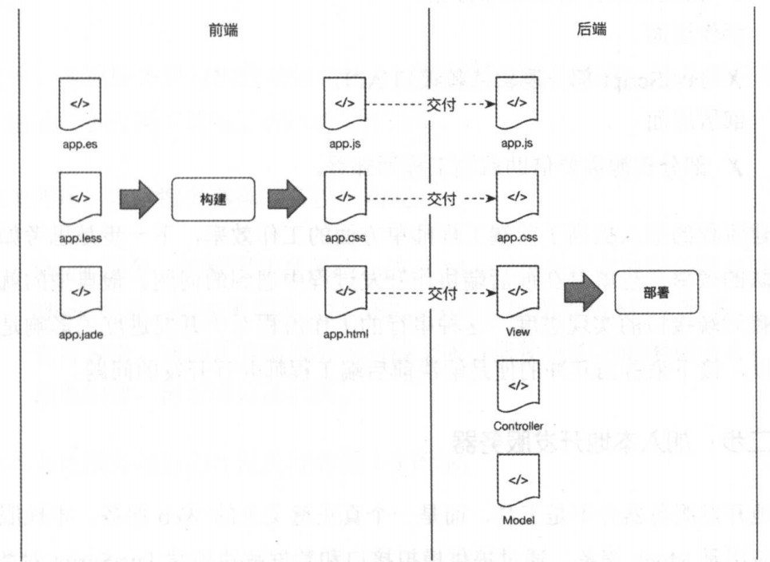

# 2019-07.23
[x] vue的webpack模板   
[x] 前端工程化思维导图
# 2019.07.24
[x] 前端工程化演讲稿  
[] ppt  
[] 配图 
初稿：
# 浅谈前端工程化
## 目前公司发展前端遇到的问题
### 1. 项目使用的框架不同（个人所看到，所以不是全部）
  
项目：  
- 教师点评H5
- CMS系统
- OA系统
- 某些APP内嵌H5  
  
项目： 
- 直播学生WEB端
- 直播老师PC端
- APP广告弹窗内嵌H5   
     
项目： 
- 直播端画板工具
- 过去一些APP内嵌H5
    
项目： 
- 直播老师PC端
- 直播学生PC端（还没有立项，但是有这个打算）
### 2. 使用脚手架不同
由于不同框架官方提供的脚手架不同，而且即使相同框架也有不同版本和类型的脚手架。  
1. vue.js
- vue-cli2 使用webpack3
- vue-cli3 使用webpack4
2. react.js
- create-react-app 使用webpack 3-> 4
- Rekit 使用webpack
3. electron
- electron-cli
- vue-electron
- react-electron
### 3. 不同脚手架引发的问题
1. 学习成本高。由于使用脚手架不同，导致生成项目配置文件甚至一些思想都不一样，不但对于新人开发有困难，对于老司机也要慢慢看才能根据需求修改配置，学习成本高，开发节奏慢。
2. 项目结构混乱。由于脚手架决定了项目结构，所以不同项目交接或者合作时候会有大量沟通成本。
3. 开发效率慢。随着项目不断发展，项目会不断庞大，需要对构建工具需要优化，但是由于官方的脚手架上手成本很高，很难快速修改，就出出现开发热跟新和打包速度慢，开发效率低下。
4. 项目环境多
- 本地开发环境
- 开发环境
- 测试环境
- 生产环境
- 灰度测试环境
- 预发布环境
这么多环境，而且遇上微信项目每个环境的配置都不一样可想配置成本是有多高。
### 4. 项目不够稳定
这个是由于js是一门弱类型语音，会经常出现一些由于类型被偷偷转换导致的bug。而这种bug是十分隐形，只有在运行时候才会出现，很难找出啦，导致项目隐藏很多不稳定的因素。即使写的函数里面注明了类型，但是交接时候还是会出问题。  
  
所以以后甚至会使用typscript。  
typscript是JS一门超集，强类型语音。由于是JS的超集，JS拥有的typscript都拥有，并且可以在编译之前就能找出类型转换出现的问题。

目前主流框架REACT和VUE都使用typscript重构。
主流大公司都在使用
- 蚂蚁金服
- 字节跳动
- 滴滴
- 有赞  

### 使用构建工具将不同
由于公司项目发展飞快，需要有自己共有的函数库与UI框架来支撑。但是公用的函数库和UI框架有最大的问题，就是打包的大小。
传统的是使用webpack，但是目前有更好的打包工具rollup。
用简单几句话描述rollup就是比起webpack，打包更快，打出来的包更小。能自动去除无用代码。
**所以这时候需要再次强调和实现前端工程化**
## 前端工程化简史
### 混沌时期
这个时候前端还是比较简单，只是切切页面，定位甚至不是工程师而是美工。主要工作流程就是前端写demo,后端写逻辑和套模板。代码都是嵌入在后端模板语言里面。


问题：  
 效率非常低下，由于存在后端二次加工，有时候div没有闭合而出现bug，都不知道是前端写的时候出问题，还是后端二次加工出现。 这时候就需要慢慢排查，浪费大量时间。
### 前后端分离
随着业务越来越复杂和ajax诞生，前端的数据可以通过异步请求获取，这促使了前后端分离。在这种模式下，后端工程师不需要对前端代码二次加工，效率大大提供。

这时候出现什么问题：
1. 我想使用ES6等语法，但是浏览器不支持。
2. css编写样式效率太低，而且不同浏览器还需要添加前缀，如-webkit-,-ms-等，效率太低了。
3. 本地开发的时候静态资源都是本地相对地址，上线需要改为真实的URL，手动改容易出错。
4. 处于性能优化，上线时候要将JS,CSS,图片进行压缩，每次都要手动用工具处理，十分繁琐和低效率。
### 构建工程化
对于之前上面的问题就需要构建流程，常用构建工具有webpack，gulp。也就是我们现在开发流程。他能解决一下问题：
1. 通过babel来做JS浏览器兼容
2. 可以使用less，scss等CSS 预处理语言，利用postcss做到不同浏览器css兼容。
3. 通过url-loader压缩图片和转成base64
4. 代码压缩  
and so on 后面还会有详细介绍
所以我们也很庆幸很跟上时代的潮流，进行如此高效开发。根据我的了解目前好多公司技术栈还是停留在上一个前后端分离。

## 工作流程
目前主流开发流程如下

通过脚手架创建项目工程文件，通过构建工具进行开发和打包，然后交付测试后上线。
### 脚手架
#### 为何需要脚手架
1. 本质
脚手架本质就是根据自定义创建项目。
2. 解决什么问题
上面听上去好像很简单，对工程化并没有啥帮助，但是在互联网产告诉迭代节奏业务需求复杂下，工程师已经没有太多时间来慢慢根据业务场景来搭建或者修改项目配置文件。而且构建和修改项目配置文件需要学习成本，新手没法一下子直接进行业务开发。所以脚手架起到快速建立项目，降低配置学习成本，让开发者更加关注业务开发的作用。
3. 流程

#### 61-tpl-cli
1. 解决什么问题
回到一开始公司发展遇到以下问题
- 框架多有vue，react，electron
- 由于使用不同框架的脚手架创建导致配置难
- 没有对构建工具进行优化，导致开发效率低下
- 使用语言即将有不同，分为JavaScript和typscript
- 构建工具即将不同，webpack和rollup
2. 优点
为了解决以上问题，而开发出来的61tpl-cli。有以下优点
- 安装方便，已经发布到npm和yarn可用通过
```
npm i -g 61tpl-cli
```
```
cnpm i -g 61tpl-cli
```
```
yarn install -g 61tpl-cli
```
- 能通过统一脚手架生成vue，react，electron等项目环境，能选择JavaScript还是typscript，构建工具也能选择rollup还是webpack

- 每个模板支持自定义  

- 能自动更新脚手架，不需要手动更新。开发节奏能更快更稳定。
- 多环境配置，符合目前项目情况

3. 编写思路
一开始是想使用大家推荐的yeoman。  
  
并且明华已经变成了一个demo  
地址：http://gitlab.61info.com/61tech-live-fe/generator-61tpl

但是我发现有以下缺点
1. 所有模板都需要放在yeoman里面，不方便维护（这个最重要）
2. 需要学习他的API，有一定的学习成本
3. 暂时没有找到自动更新的方法

所有参考网上大量的文章，vue-cli 2和网上大量优秀的脚手架（很多还是用typscript写的，导致现在学会typscript了。。。）自己重写了一套脚手架
具体流程如下


1. 通过用户选项去gitlab拉去对应的模板
2. 用户选择需要的配置
3. 更加模板渲染出项目配置文件
4. 输出  
  
### 构建

1. 包管理
将js变成模块，可以使用commonJS或者es6 module引入  
使用npm或者yarn进行管理
2. 代码规范
通过eslint，当开发者编写如空格没有符合规范就会提示错误。  
详细可以看附件- 规范文档
3. 资源管理
- js。通过babel将es6+语法对浏览器兼容。通过js压缩工具减少资源大小。
- css。同postcss对不同浏览器如chrome，火狐，IE，Opera的不同版本最兼容。并且压缩
- 图片。通过url-loader和image-loader进行图片压缩，对于小图片会变成base64来减少请求数量。
4. 热更新。修改后不需要刷新页面，直接看到更新后结果。
5. dev-server。可以使用mock层来加快前端开发效率。
#### 优点
那么和传统官方提供的vue-cli和create-react-app比有哪些优点。
1. 构建速度快。基于多线程打包和DLL预打包技术。多线程打包。js是一门单线程语音，导致node也是单线程运行，webpack是基于node基础上编写，所以打包也是单线程，计算机资源没有很好被调用。而这套模板可以使用多线程打包。DLL预打包是提前将vue，vux，vue-router，loadsh等库提前打包，这样打包时候就不需要再打包，节约时间。
2. 打包资源变小。对资源都进行压缩。
3. 热更新更快。由于DLL预打包，对于修改后的文件webpack watch不会在查看依赖是否有修改。大大提升diff算法的速度。
3. 配置容易上手。参考vue-cli配置和命名风格，把常用配置单独抽离，并且有大量中文配置,只用过vue-cli的人也能快速上手。    

4. 支持多环境 
目前能支持
- 本地环境
- 开发环境
- 测试环境
- 灰度测试环境
- 预发布环境

**更多可以参考附件 - 构建性能测试报告**

目前OA系统已经使用此构建模板，效率有大大提高
地址： 
http://gitlab.61info.com/internalcommon/oa_system_web
## 2019.07.24


 
