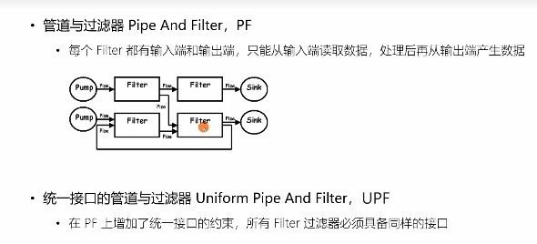
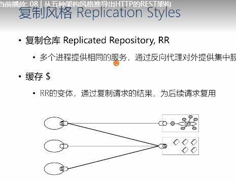
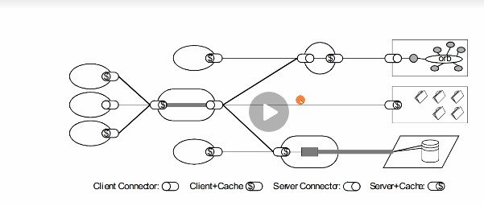
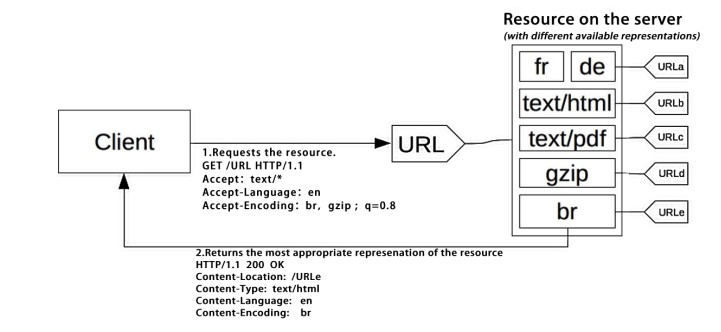

# 2019.08.19
## 极客时间web协议
**架构原则**
- 性能影响可用的关键
- 课伸缩性 支持部署大量组件
- 简单性 易理解、易实现、易验证
- 可见性 两个组件间交互进行相互监视
- 可移植性 不同环境运行的能力
- 可靠性 出现故障时， 对整体影响程度
- 可修改性 对系统修改的难度

性能：  
- 网络性能
  - 吞吐量，小于宽带
  - 开销
- 用户感知的性能
  - 延迟： 发起请求到接受响应的时间
  - 完成时间： 完成一个应用所花费的时间
- 网络效率
  - 重用缓存、减少交互次数

课修改性：
- 可进化性： 一个组件单独升级不影响其他组件
- 可扩展： 想系统添加功能而不影响系统其他部分
- 可制定性： 临时、制定性更改某一个要素来提供服务
- 可配置性： 应用部署后修改配置提供新的功能
- 可重用性： 组件可不修改在其他应用使用

5 种架构风格
- 数据流风格：
  - 简单性、可进化性、可扩展性、可配置
  - 
- 复制风格
  - 用户可察觉性、可扩展性、可伸缩性、网络效率、可靠性
  - 
- 分层性
  - 简单性、可进化性、可伸缩性
  - 
- 移动代码风格
  - 可移植性、可扩展性、网络效率
- 点对

过滤器：
- domain 域名
- method 方法
- mime-type 显示MIME资源
## 每天一题
### 第 53 题：输出以下代码的执行结果并解释为什么
```javascript
var a = {n: 1};
var b = a;
a.x = a = {n: 2};

console.log(a.x) 	
console.log(b.x)
```
最后输出的是什么？ 先不说答案，我们来分析一下
L2(第二行) 我们把a赋值给b， 由于a是对象类型，这就意味着b和a指向同一个内存地址
L3 a.x = a = { n: 2}
这里我们有个疑惑，这句语句执行顺序是 a = {n: 2} && a.x = {n:2} 还是 a.x = {n:2} && a= {n:2} 还是这种 a = {n: 2} && a.x = a
我们这里可以借助 Object.defineProperty 或 ES6的 Proxy来验证多项赋值的顺序是怎样的
```javascript
const obj = new Proxy({}, {
  set(target, key, value, r) {
    console.log(key, value)
    if (key === 'a') Reflect.set(target, key, 'isA', r);
    else Reflect.set(target, key, value, r);
  }
});

obj.b = obj.a= {n: 1};
// 输出:
// "a" {n: 1}
// "b" {n: 1}

obj.a; // isA
obj.b; // {n: 1}

```
所以我们可以得出 赋值的顺序是从右边开始到左边的。而且是直接 a = {n: 1}, a.x = {n:1 }，而不是 a.x = a 这样去赋值
现在我们再借助 Proxy 来分析一开始part1这道题，用obj.a, obj.b 来代替原题目的 a和b。
```javascript
var obj = new Proxy({}, {
  get: function (target, key, receiver) {
    console.log(`getting ${key}!`);
    return Reflect.get(target, key, receiver);
  },
  set: function (target, key, value, receiver) {
    console.log(`setting ${key}!`);
    return Reflect.set(target, key, value, receiver);
  }
});

obj.a = {n: 1 };// getting a;
obj.b = obj.a; // getting a; setting b;
obj.a.x = obj.a = {n:2 }; // getting a; setting a;
```
可以看到 obj.a.x = obj.a = {n: 2}这段语句执行时，会先输出一个 getting a 再输出 setting a。   
这就意味着在对 obj.a.x 赋值时，程序是先获取 obj.a指向的对象的内存地址，此时触发了 getting a，然后再对右边 obj.a 进行赋值，触发了 setting a， 赋值完最后一步才是对 obj.a.x赋值 {n:2 }。
重点: 在对obj.a.x赋值的时刻已经获取了obj.a该对象指向的内存地址，所以后面a就算指向其他地址，也和这里的obj.a.x无关。此时指向该地址的还有obj.b
我们再用三张图来捋一捋整理的思路
执行 obj.a = {n: 1}; obj.b = obj.a后obj对应的引用是这样的

执行 obj.a.x = xxx 时 

执行obj.a.x = obj.a = {n:2} 后 

至此，这道面试题相信大家都有答案了，可以自己去控制台验证一下。 假如这时候再执行 obj.a.n = 3， 打印obj.b会输出什么呢？

### 第 54 题：冒泡排序如何实现，时间复杂度是多少， 还可以如何改进？
默认
```javascript
function bubleSort(arr) {
  for (let i = 0; i < arr.length; i++) {
    for (let j = 0; j < arr.length - 1 -1; j++) {
      if (arr[j] > arr[j+1]) {
        [arr[i], arr[j]] 
      }
    }
  }
}
```

```javascript
function bubleSort(arr) {
  let i = arr.length - 1
  while (i>0) {
    let pos = 0
    for (let j = 0; j< i;)
  }
}
```
# 2019.08.20
## 极客时间
- URL表示资源位置，期望提供查找资源的方法
- URN 期望为资源提供持久的，位置无关的标识方法
- URI
  - 资源可以是图片，文档，一个资源可以多个URI
  - 标识符，将当前资源与其他资源分开的名称
  - 统一
  - 组成
    - scheme
    - hier-part
    - query 参数
    - fragment 段落
- request-target
  - origin-form 向origin server发起请求path为空必须使用/传递
  - absolute-from 正向代理
  - authority-from 隧道
## 每日一题
### 第 55 题：某公司 1 到 12 月份的销售额存在一个对象里面
如下：{1:222, 2:123, 5:888}，请把数据处理为如下结构：[222, 123, null, null, 888, null, null, null, null, null, null, null]。
```javascript
let obj = {1:222, 2:123, 5:888}
const result = Array.from({length: 12}).map((item,index) => obj[index-1]||null)
console.log(result)
```

### 第 57 题：分析比较 opacity: 0、visibility: hidden、display: none 优劣和适用场景。
- display: none (不占空间，不能点击)（场景，显示出原来这里不存在的结构）
- visibility: hidden（占据空间，不能点击）（场景：显示不会导致页面结构发生变动，不会撑开）
- opacity: 0（占据空间，可以点击）（场景：可以跟transition搭配）

### 第 58 题：箭头函数与普通函数（function）的区别是什么？构造函数（function）可以使用 new 生成实例，那么箭头函数可以吗？为什么？
引入箭头函数有两个方面的作用：更简短的函数并且不绑定this。箭头函数与普通函数不同之处有：
- 箭头函数没有 this，它会从自己的作用域链的上一层继承 this（因此无法使用 apply / call / bind 进行绑定 this 值）；
- 不绑定 arguments，当在箭头函数中调用 aruguments 时同样会向作用域链中查询结果；
- 不绑定 super 和 new.target；
- 没有 prototype 属性，即指向 undefined；
- 无法使用 new 实例化对象，因为普通构造函数通过 new 实例化对象时 this 指向实例对象，而箭头函数没有 this 值，同时 箭头函数也没有 prototype。

### 第 59 题：给定两个数组，写一个方法来计算它们的交集。
```javascript
var nums1 = [1, 2, 2, 1], nums2 = [2, 2, 3, 4];
function union (num1, num2) {
  return num1.filter(item => {
    return num2.includes(item)
  })
}
console.log(union(nums1, nums2))
```


### 第 56 题：要求设计 LazyMan 类，实现以下功能。
```javascript
LazyMan('Tony');
// Hi I am Tony

LazyMan('Tony').sleep(10).eat('lunch');
// Hi I am Tony
// 等待了10秒...
// I am eating lunch

LazyMan('Tony').eat('lunch').sleep(10).eat('dinner');
// Hi I am Tony
// I am eating lunch
// 等待了10秒...
// I am eating diner

LazyMan('Tony').eat('lunch').eat('dinner').sleepFirst(5).sleep(10).eat('junk food');
// Hi I am Tony
// 等待了5秒...
// I am eating lunch
// I am eating dinner
// 等待了10秒...
// I am eating junk food
```
```javascript
class LazyManClass {
  constructor(prop) {
    this.name = prop
    this.queue = []
    console.log(`Hi I am${prop}`)
    setTimeout(() => {
      this.next()
    }, 0);
  }
  next() {
    if (this.queue.length) {
      let fn = this.queue.shift()
      fn && fn()
    } else {
      return this
    }
  }
  // sleep(time) {
  //   let that = this
  //   let fn =   () => {
  //     setTimeout(() => {
  //     console.log(`等待了${time}s`)
  //     that.next()
  //     }, 10);
  //   }
  //   this.queue.push(fn)
  //   return this
  // }
  sleep(time) {
    var that = this
    var fn = (function (t) {
      return function () {
        setTimeout(() => {
          console.log(`等待了${t}秒...`)
          that.next();
        }, t * 1000);
      }
    })(time);
    this.queue.push(fn);
    return this;
  }
  eat(food) {
    let that = this
    let fn = () => {
      console.log(food)
      that.next()
    }
    this.queue.push(fn)
    return this
  }
  sleepFirst(time) {
    var that = this;
    var fn = (function (t) {
      return function () {
        setTimeout(() => {
          console.log(`等待了${t}秒...`)
          that.next();
        }, t * 1000);
      }
    })(time);
    this.queue.unshift(fn);
    return this;
  }
}
function LazyMan(params) {
  return new LazyManClass(params)
}
```
# 2019.08.21
# 2019.08.22
生病
# 2019.08.23

消息的转发
- Max-Forwards 头部 
  - • 限制 Proxy 代理服务器的最大转发次数，仅对 TRACE/OPTIONS 方法有效
  - Max-Forwards = 1*DIGIT
- Via 头部
  - 指明经过的代理服务器名称及版本
  - Via = 1#( received-protocol RWS received-by [ RWS comment ] )
- Cache-Control:no-transform 禁止代理服务器修改响应包体

X-Forwarded-For 用于传递 IP

请求上下文
- User-Agent 指明客户端的类型信息，服务器可以据此对资源的表述做抉择
- Referer 浏览器对来自某一页面的请求自动添加的头部
  - Referer 不会被添加的场景
    - 来源页面采用的协议为表示本地文件的 "file" 或者 "data" URI
    - 当前请求页面采用的是 http 协议，而来源页面采用的是 https 协议
  - 用处
    - 统计分析
    - 缓存优化
    - 防盗链
- From 告诉服务器如何通过邮件联系到爬虫的负责人 From: webmaster@example.org
- server 指明服务器上所用软件的信息，用于帮助客户端定位问题或者统计数据
- Allow 告诉客户端，服务器上该 URI 对应的资源允许哪些方法的执行
- Accept-Ranges 告诉客户端服务器上该资源是否允许 range 请求

内容协商：   
每个 URI 指向的资源可以是任何事物，可以有多种不同的表述，例如一份
文档可以有不同语言的翻译、不同的媒体格式、可以针对不同的浏览器提
供不同的压缩编码等。
- 主动式内容协商：指由客户端先在请求头部中提出需要的表述形式


响应式内容协商： Acceptable，由客户端选择一种表述 URI 使用


协商要数
- 质量因子 q：内容的质量、可接受类型的优先级
- 媒体资源的 MIME 类型及质量因子
- 字符编码 Accept-Charset
- 内容编码 Accept-Encoding: gzip, deflate, br
- 表述语言  Accept-Language
## 浏览器工作原理
chrome启动4个进程

多线程可以处理任务，线程不能单独存在，由进程启动和管理

一个进程是一个程序的运行实例

线程之间共享进程中的数据
# 2019.08.24
linux 分为
  - 内核版本 
  - 发行版本
# 2019.08.25
## 极客时间浏览器
### 第一章
chrome启动4个进程

多线程可以处理任务，线程不能单独存在，由进程启动和管理

一个进程是一个程序的运行实例

线程之间共享进程中的数据

线程和进程的关系
- 一个线程中任意一个线程出错，导致整个进程崩溃
- 线程之间共享进程中的数据
- 当一个进程关闭之后，操作系统会回收进程所占用的内存
- 进程之间内容互相独立

单进程浏览器：  
浏览器所有功能模块都在一个进程里面包括以下
- 网络
- 插件
- JavaScript运行环境
- 页面渲染

问题 
- 不稳定，一个插件会引起整个浏览器崩溃
- 不流畅，脚本和插件会让浏览器卡顿，内存泄露也是一个非常复杂
- 不安全，由于插件在是同一进程，所以可以窃取你的密码

早期多进程架构

目前多进程架构

- 浏览器进程： 主要负责界面显示、用户交互、子进程管理，同时提供存储等功能。
- 渲染进程：核心任务是将 HTML、CSS 和 JavaScript 转换为用户可以与之交互的网页，排版引擎 Blink 和 JavaScript 引擎 V8 都是运行在该进程中，默认情况下，Chrome 会为每个 Tab 标签创建一个渲染进程。出于安全考虑，渲染进程都是运行在沙箱模式下。
- GUP: Chrom的UI界面都是采用GUP绘制
- 网络进程： 主要负责网页资源加载
- 插件： 因为插件容易崩溃，所欲需要插件进程来隔离

代开浏览器四个进程
- 网络进程
- 浏览器进程
- GPU进程
- 渲染进程

未来面向服务的架构
chrome整个架构会朝向线代操作系统，原来各种模块会被重构独立的服务，每个服务都是可以独立进程运行，访问服务必须定义好借口，通过IPC来通信


Chrome是一个非常快速进化，越来越多业务和服务都逐渐转至浏览器，身为开发，应该紧跟步伐，收获这波技术红利
### 第二章

- IP: 把数据报传送达到目标主机
计算机的地址成为IP地址，访问任何一个网站实际只是你计算机向另外计算机请求信息。
- UDP，把数据包送达应用程序。通过端口号就能把制定的数据包发送给指定的程序。
- tcp把数据完整送达应用程序 TCP是一种面向连接的、可靠的、基于字节流的传输层通信协议

TCP连接过程
- 建立连接阶段，通过三次握手创建客户端和客户端的连接
- 传输数据，接收需要对每个数据包进行操作。
- 端口连接

### 第三章
发起HTTP请求流程
1. 构建请求
2. 查找缓存
3. 准备IP地址和端口
4. 等待TCP队列，同一个域名同时最多6个TCP连接
5. 建立TCP连接
6. 发起HTTP请求

接收HTTP过程
1. 返回请求
2. 断开连接，关闭TCP连接
3. 重定向

缓存策略


强制缓存可用
- Cache-Control： Max-age
- express
协商缓存
- 通过if-noe-match来判断资源是否更新，如果没有直接返回304

登录状态保持
- 打开登录页面，发起登录操作，将用post提交用户登录信息
- 接收用户登录信息是否正确，如果正确就生成一段用户字符串，并且set-cookie给浏览器
- 浏览器接收服务器响应头，开始解析响应头，把set-cookie保存在本地
- 当用户再次访问的时候，浏览器会把之前cookie的数据写进请求头
- 服务器接收到并找到cookie字段信息

总结：
