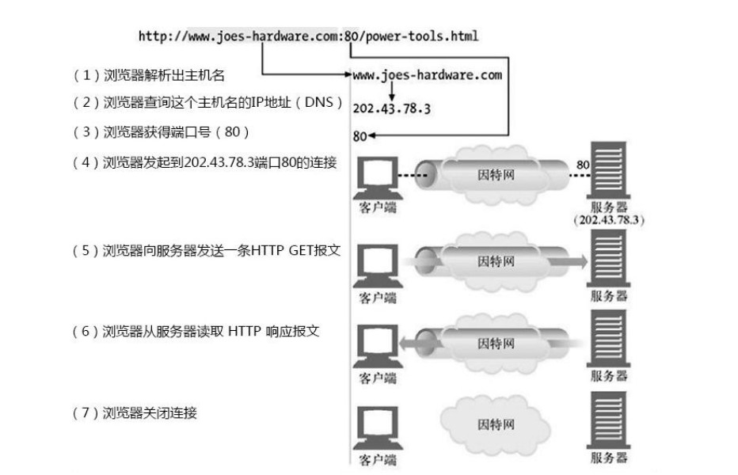
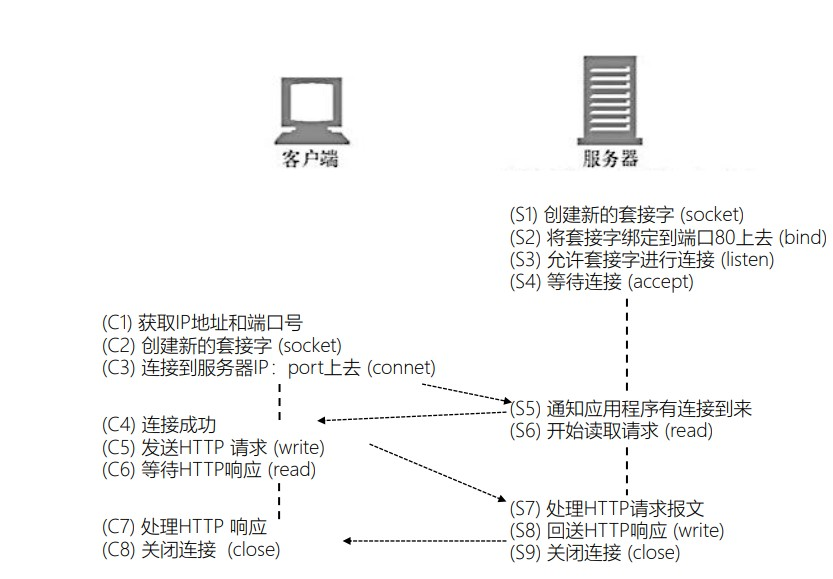

# 2019.08.26
## HTTP协议
http连接流程



承载消息的内容
- 请求或者响应都可以携带包体
- 以下消息不能含有包体
  - HEAD方法请求对应的响应
  - 1xx 204 304
  - connect方法对应的2xx响应

使用Content-Length头部指明包体长度，如果不对浏览器就无法正确解析

当不知道包的长度时候使用Transfer—Encodeing头部指明使用Chunck传输

Transfer-Encoding头部
  - transfer-coding ="chunked" / "compress" / "deflate" / "gzip" / transfer-extension
  - chunked-body = *chunk last-chunk trailer-part CRLF

Trailer
- TE头部：客户端在请求在声明是否接收 Trailer 头部
- railer 头部：服务器告知接下来 chunk 包体后会传输哪些 Trailer 头部

MIME
- type := discrete-type / composite-type
  - discrete-type := "text" / "image" / "audio" / "video" / "application" / extension-token
  - • composite-type := "message" / "multipart" / 

  HTML FORM
提供了交互控制元件用来向服务器通过 HTTP 协议提交信息，常见控件有
- action：提交时发起 HTTP 请求的 URI
- method：提交时发起 HTTP 请求的 http 方法
  - GET：通过 URI，将表单数据以 URI 参数的方式提交
  - POST：将表单数据放在请求包体中提交
- Text Input Controls：文本输入控件
- Checkboxes Controls：复选框控件
- Radio Box Controls ：单选按钮控件
- Select Box Controls：下拉列表控件
- File Select boxes：选取文件控件
- Clickable Buttons：可点击的按钮控件
- enctype：在 POST 方法下，对表单内容在请求包体中的编码方式
  - application/x-www-form-urlencoded 
  - • 数据被编码成以 ‘&’ 分隔的键-值对, 同时以 ‘=’ 分隔键和值，字符以 URL 编码方式编码
Content-type 头部指明是多个表描包体
  - Content-type： multipart、form-data
Boundary 分隔符
每个multipart-body包含
- content-disposition: form-data; name="xxxxx“
- content-type 头部指明该部分包体的类型
**这个需要详细学习**
## 每日一题
### 第 60 题：已知如下代码，如何修改才能让图片宽度为 300px ？注意下面代码不可修改。
```html

```
max-width可以覆盖掉!important

### 第 61 题：介绍下如何实现 token 加密
Token - 服务端身份验证的流行方案
#### 身份认证
服务端提供资源给客户端，但是某些资源是有条件的。所以服务端要能够识别请求者的身份，然后再判断所请求的资源是否可以给请求者。

token是一种身份验证的机制，初始时用户提交账号数据给服务端，服务端采用一定的策略生成一个字符串（token），token字符串中包含了少量的用户信息，并且有一定的期限。服务端会把token字符串传给客户端，客户端保存token字符串，并在接下来的请求中带上这个字符串。


#### Token机制
1. 服务端如何根据token获取用户的信息？
2. 如何确保识别伪造的token？
3. 如何应付冒充的情况？

用户匹配  
服务端在生成token时，加入少量的用户信息，比如用户的id。服务端接收到token之后，可以解析出这些数据，从而将token和用户关联了起来。

防伪造
一般情况下，建议放入token的数据是不敏感的数据，这样只要服务端使用私钥对数据生成签名，然后和数据拼接起来，作为token的一部分即可。比如JWT，参考JSON Web Token - 在Web应用间安全地传递信息。

防冒充  
服务端在生成token时，使用了客户端的UA作为干扰码对数据加密，客户端进行请求时，会同时传入token、UA，服务端使用UA对token解密，从而验证用户的身份。

如果只是把token拷贝到另一个客户端使用，不同的UA会导致在服务端解析token失败，从而实现了一定程度的防冒充。但是攻击者如果猜到服务端使用UA作为加密钥，他可以修改自己的UA。

有效期

给token加上有效期，即使被冒充也只是在一定的时间段内有效。这不是完美的防御措施，只是尽量减少损失。

服务端在生成token时，加入有效期。每次服务端接收到请求，解析token之后，判断是否已过期，如果过期就拒绝服务。

token刷新

如果token过期了，客户端应该对token续期或者重新生成token。这取决于token的过期机制。

1. 服务器缓存token及对应的过期时间这个时候就可以采用续期的方式，服务器更新过期时间，token再次有效。

2. oken中含有过期时间这个时候需要重新生成token。


##### Token工作流程


### 第 62 题：redux 为什么要把 reducer 设计成纯函数
简而言之，使用到纯函数，函数式思维。

### 第 63 题：如何设计实现无缝轮播
忽略

### 第 64 题：模拟实现一个 Promise.finally
```javascript
Promise.prototype.finally = function (callback) {
  let P = this.constructor;
  return this.then(
    value  => P.resolve(callback()).then(() => value),
    reason => P.resolve(callback()).then(() => { throw reason })
  );
};
```
### 第 65 题： a.b.c.d 和 a['b']['c']['d']，哪个性能更高
无
### 第 66 题：ES6 代码转成 ES5 代码的实现思路是什么 
- 解析：解析代码字符串，生成 AST；
- 转换：按一定的规则转换、修改 AST；
- 生成：将修改后的 AST 转换成普通代码。
### 第 67 题：随机生成一个长度为 10 的整数类型的数组，例如 [2, 10, 3, 4, 5, 11, 10, 11, 20]，将其排列成一个新数组，要求新数组形式如下，例如 [[2, 3, 4, 5], [10, 11], [20]]。

```javascript
// 得到一个两数之间的随机整数，包括两个数在内
function getRandomIntInclusive(min, max) {
  min = Math.ceil(min);
  max = Math.floor(max);
  return Math.floor(Math.random() * (max - min + 1)) + min; //含最大值，含最小值 
}
// 随机生成10个整数数组, 排序, 去重
let initArr = Array.from({ length: 10 }, (v) => { return getRandomIntInclusive(0, 99) });
initArr.sort((a,b) => { return a - b });
initArr = [...(new Set(initArr))];

// 放入hash表
let obj = {};
initArr.map((i) => {
  const intNum = Math.floor(i/10);
  if (!obj[intNum]) obj[intNum] = [];
  obj[intNum].push(i);
})

// 输出结果
const resArr = [];
for(let i in obj) {
  resArr.push(obj[i]);
}
```
### 第 68 题： 如何解决移动端 Retina 屏 1px 像素问题 
1 伪元素 + transform scaleY(.5)
2 box-shadow: inset 0 -1px 1px -1px black
## 关于提前结束一题
看了一下后面的题目，大多数都是算法题，和一些无关重要的题目，感觉意义不大，而且时间比较紧迫就没有继续进行下去了。

## leetcode
### 01 两数之和
用空间换时间
1. 建立map表，存放第一个数字，并存放该数字的index
2. 判断map是否存在target-当前数字cur
3. 存在直接返回target-当前数字cur与当前cur的index
4. 不存在就返回当前数字cur为key，当前数字的index值存放map
```javascript
var twoSum = function(nums, target) {
  let res 
  let map = {}
  nums.some((item,index)=> {
    // debugger
    if ((target - item) in map) {
      res = [map[target - item],index]
      return true
    } else {
      map[item] = index
      return false
    }
  })
  return res
 };
```

# 2019.08.27
## linux
常见目录： 
- / 根目录
- /root 用户的家目录
- /home/username 普通用户
- /etc 配置文件目录
- /bin 命令行目录
- /sbin管理命令目录
- /usr/bin/sur/sbin 系统预安装的其他命令

man 帮助  
type cd 参考是否内部命令
nebula命令帮助
help cd  
外部命令帮助
ls --help

文件管理：
- pwd: 显示当前路径
- cd 更换路径
 - -回到上次目录
- ls 查看当前目录下的文件
  - -l 长格式显示文件
    - -普通文件
    - d 目录
  - -a 隐藏文件
  - -r 逆序显示
  - -t 按时间顺序显示
  - -R 递归显示

Crtl + l 清除屏幕

## leetcode
### 9. 回文数
判断一个整数是否是回文数。回文数是指正序（从左向右）和倒序（从右向左）读都是一样的整数。

```javascript
/*
 * @lc app=leetcode id=9 lang=javascript
 *
 * [9] Palindrome Number
 */
/**
 * @param {number} x
 * @return {boolean}
 */
var isPalindrome = function(x) {
  let x1 = String(x)
  let arr = x1.split("")
  if (arr.reverse().join("") === x1) return true
  return false
};
```
### 14. 最长公共前缀
编写一个函数来查找字符串数组中的最长公共前缀。

如果不存在公共前缀，返回空字符串 ""。
```
输入: ["flower","flow","flight"]
输出: "fl"
```

```
示例 2:
输入: ["dog","racecar","car"]
输出: ""
解释: 输入不存在公共前缀。
```

```javascript
var longestCommonPrefix = function(strs) {
  if (!strs.length) return ""
  let res
  let i = 0
  let end = strs[0].length
  // debugger
   while (i <= end && strs.every((item) => { return item.indexOf(strs[0].substr(0,i)) === 0})) {
     res = strs[0].substr(0,i)
     i ++
   }
   if (res) return res
   else return ""
}
```
# 2019.08.28
- rollupJs打包
- Prettier 代码风格
- TypeDoc 生成文档提交到githubPage
- Jest 单元测试
- Commitizen 规范注释
- Semantic release 管理和发布
- husky 帮助简单实用 git hook
- Conventioal Changelog

请求url处理

参数值为数组
```javascript
foo: ['bar', 'baz']
```
```
/base/get?foo[]=bar&foo[]=baz'
```

参数值为对象
```javascript
 foo: {
      bar: 'baz'
    }
```
```
/base/get?foo=%7B%22bar%22:%22baz%22%7D
```

参数值为 Date 类型
```javascript
const date = new Date()
```
```
/base/get?date=2019-04-01T05:55:39.030Z
```
特殊字符支持
```javascript
  foo: '@:$, '
```
```
  .replace(/%40/g, '@')
  .replace(/%3A/gi, ':')
  .replace(/%24/g, '$')
  .replace(/%2C/gi, ',')
  .replace(/%20/g, '+')
  .replace(/%5B/gi, '[')
  .replace(/%5D/gi, ']')
```

空值忽略
```
 params: {
    foo: 'bar',
    baz: null
  }
```
```
/base/get?foo=bar
```
# 2019.08.30

# 2019.08.31
