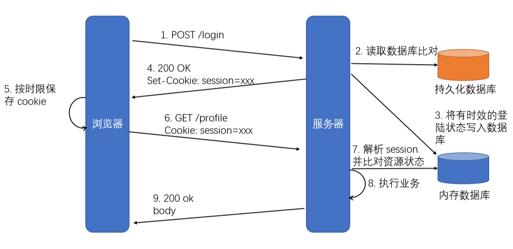
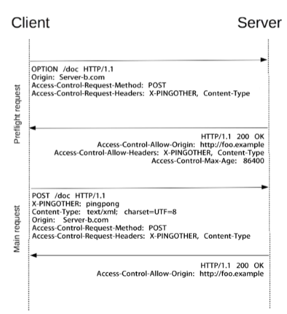
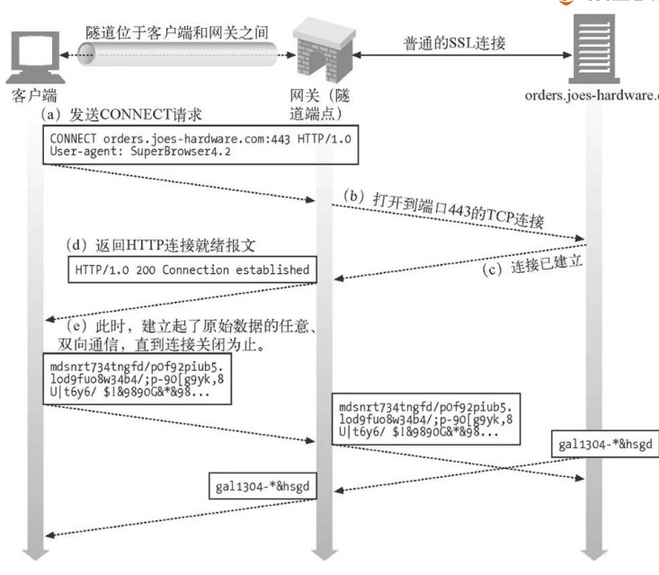
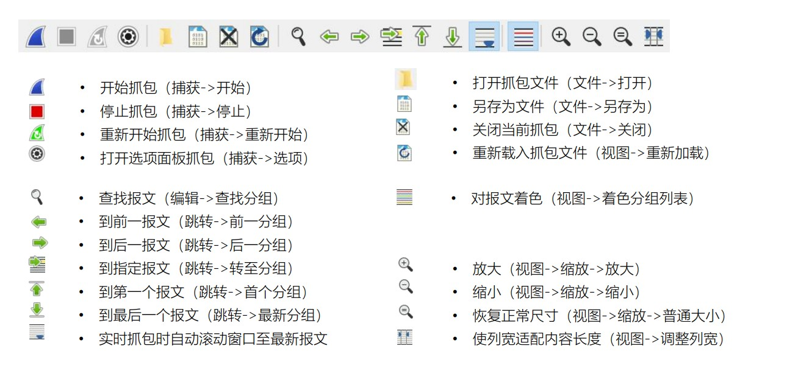
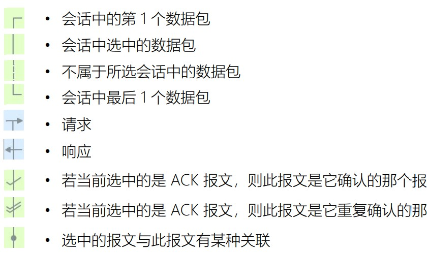
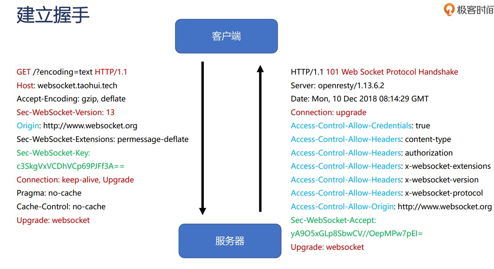
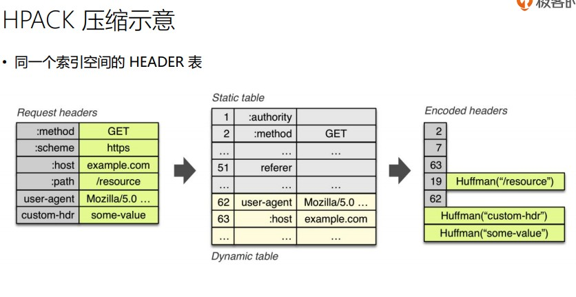
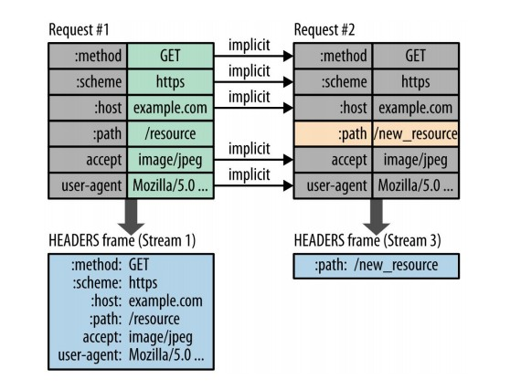

# 2019.09.01
HTTP rang
 允许服务器基于客户端的请求只发送响应包体的一部分给到客户端，而客户端 自动将多个片断的包体组合成完整的体积更大的包体 

 服务器通过 Accept-Range 头部表示是否支持 Range 请求 
 Accept-Ranges =  bytes：支持 
 Accept-Ranges: none：不支持

 206 Partial Content 
 Content-Range 头部：显示当前片断包体在完整包体中的位置 
 Content-Range: bytes 42-1233/1234  字节范围/总字节数

 以视频为例子：
 request   
 Range: bytes=20840448-37656742 请求范围
 reponse
 bytes 20840448-37656742/37656743 返回范围/总字段长度

 Cookie 是什么？
保存在客户端、由浏览器维护、表示应 用状态的 HTTP 头部
- 存放在内存或者磁盘中 
- 服务器端生成 Cookie 在响应中通过 Set-Cookie 头部告知客户端（允许多 个 Set-Cookie 头部传递多个值
-  客户端得到 Cookie 后，后续请求都会 自动将 Cookie 头部携带至请求中
Set-Cookie 中描述 cookie-pair 的属性
-  "Expires=" sane-cookie-date cookie 到日期 sane-cookie-date 后失效 
-  "Max-Age=" non-zero-digit *DIGIT  cookie 经过 *DIGIT 秒后失效。max-age 优先级高于 expires 
-  "Domain=" domain-value   指定 cookie 可用于哪些域名，默认可以访问当前域名 
-  "Path=" path-value 指定 Path 路径下才能使用 cookie 
- "Secure“  只有使用 TLS/SSL 协议（https）时才能使用 cookie 
-  "HttpOnly“  不能使用  JavaScript（Document.cookie 、XMLHttpRequest 、Request APIs）访问到 cookie

Cookie 在协议设计上的问题
- Cookie 会被附加在每个 HTTP 请求中，所以无形中增加了流量 
- 由于在 HTTP 请求中的 Cookie 是明文传递的，所以安全性成问题（除 非用 HTTPS） 
-  Cookie 的大小不应超过 4KB，故对于复杂的存储需求来说是不够用的 




第三方Cookie
浏览器允许对于不安全域下的资源（如广告图片）响应中的 Set-Cookie 保存，并在后续访问该域时自动使用 Cookie 

浏览器的同源策略
何谓同源？协议、主机、端口必须完全相同 
```
 <script><iframe><link><video><audio>带有 src 属性可以跨域访问 
```
 CORS：Cross-Origin Resource Sharing

 策略 1：何为简单请求？ 
- GET/HEAD/POST 方法之一 
- 仅能使用 CORS 安全的头部：Accept、Accept-Language、Content-Language、Content-Type 
- 仅能使用 CORS 安全的头部：Accept、Accept-Language、Content-Language、Content-Type 
-  Content-Type 值只能是： text/plain、multipart/form-data、application/x-www-form-urlencoded 三者其中之一 

策略 2：简单请求以外的其他请求 
 访问资源前，需要先发起 prefilght 预检请求（方法为 OPTIONS）询问何种请求是被允许的

预检请求头部 
- Access-Control-Request-Method 
- Access-Control-Request-Headers
预检请求响应 
- Origin
  - ：一个页面的资源可能来自于多个域名，在 AJAX 等子请求中标明来 源于某个域名下的脚本，以通过服务器的安全校
- Access-Control-Allow-Methods 
  - 在 preflight 预检请求 (OPTIONS) 中，告知服务器接下来的请求会使用哪些方法 
- Access-Control-Allow-Headers 
  - 在 preflight 预检请求 (OPTIONS) 中，告知服务器接下来的请求会传递哪些头部
- Access-Control-Max-Age


响应头部
- Access-Control-Allow-Methods  在 preflight 预检请求的响应中，告知客户端后续请求允许使用的方法 
- Access-Control-Allow-Headers 在 preflight 预检请求的响应中，告知客户端后续请求允许携带的头部 
- Access-Control-Max-Age 在 preflight 预检请求的响应中，告知客户端该响应的信息可以缓存多久 
- Access-Control-Expose-Headers 
  - 告知浏览器哪些响应头部可以供客户端使用
  - Cache-Control
  - Content-Language
  - Content-Type
  - Expires
  - Last-Modified
  - Pragma
- Access-Control-Allow-Origin 告知浏览器允许哪些域访问当前资源，*表示允许所有域。为避免缓存错乱，响应中需要携带 Vary: Origin 
- Access-Control-Allow-Credentials 告知浏览器是否可以将 Credentials 暴露给客户端使用，Credentials 包含 cookie、authorization 类头部、 TLS证书等。

验证器 validator：根据客户端请求中携带的相关头部，以及服务器资源 的信息，执行两端的资源验证 
- Etag 响应头部 给出当前资源表述的标签 
- Last-Modified 响应头部 表示对应资源表述的上次修改时间

缓存

# 2019.09.02
## 极客时间http

p判断缓存是否过期
s-maxage(共享缓存)>maxe-age>expires

Age 表示自源服务器发出响应（或者验证过期缓存），到使用缓存的响应发出
时经过的秒数

对于代理服务器管理的共享缓存，客户端可以根据 Age 头部判断缓存时间

Cache-Control
请求中的值
- max-age 告诉服务器，客户端不会接受 Age 超出 max-age 秒的缓存
- max-stale ：告诉服务器，即使缓存不再新鲜，但陈旧秒数没有超出 max-stale 时，客户端仍打算使用。若 max-stale 后没有值，则表示无论过期多久客户端都可使用
- min-fresh 告诉服务器，Age 至少经过 min-fresh 秒后缓存才可使用
- no-cache 告诉服务器，不能直接使用已有缓存作为响应返回，除非带着缓存条件到上游服务端得到 304 验证返回码才可使用现有缓存
- no-store 告诉各代理服务器不要对该请求的响应缓存
- no-transform 告诉代理服务器不要修改消息包体的内容
- only-if-cached 告诉服务器仅能返回缓存的响应，否则若没有缓存则返回 504 错误码
响应头
- must-revalidate 告诉客户端一旦缓存过期，必须向服务器验证后才可使用
- proxy-revalidate 与 must-revalidate 类似，但它仅对代理服务器的共享缓存
有效
- no-cache 告诉客户端不能直接使用缓存的响应，使用前必须在源服务器验证
得到 304 返回码。如果 no-cache 后指定头部，则若客户端的后续请求及响应
中不含有这些头则可直接使用缓存
- max-age 告诉客户端缓存 Age 超出 max-age 秒后则缓存过期
- s-maxage：与 max-age 相似，但仅针对共享缓存，且优先级高于 max-age 和
Expires
- public 表示无论私有缓存或者共享缓存，皆可将该响应缓存
- private 表示该响应不能被代理服务器作为共享缓存使用。若 private 后指定头
部，则在告诉代理服务器不能缓存指定的头部，但可缓存其他部分
- no-store 告诉所有下游节点不能对响应进行缓存
- no-transform 告诉代理服务器不能修改消息包体的内容

什么样的 HTTP 响应会缓存
- 请求方法可以被缓存理解（不只于 GET 方法）
- 响应码可以被缓存理解（404、206 也可以被缓存）
- 响应与请求的头部没有指明 no-store
- 响应中至少应含有以下头部中的 1 个或者多个：
  - Expires、max-age、s-maxage、public
  - 当响应中没有明确指示过期时间的头部时，如果响应

Last-Modified -》 • If-Modified-Since
Etag -》 If-Match

为什么需要 URI 重定向
- 提交 FORM 表单成功后需要显示内容页，怎么办？
- 站点从 HTTP 迁移到 HTTPS，怎么办？
- 站点部分 URI 发生了变化，但搜索引擎或者流量入口站点只收录了老的
URI，怎么办？
- 站点更换了新域名，怎么办？

原请求：接收到重定向响应码的请求这里称为原请求
重定向请求：浏览器接收到重定向响应码后，会发起新的重定向请求

永久重定向，表示资源永久性变更到新的 URL
- 301（HTTP/1.0）：重定向请求通常（由于历史原因一些浏览器会把 POST 改为
GET）会使用 GET 方法，而不管原请求究竟采用的是什么方法
- 308（HTTP/1.1）：重定向请求必须使用原请求的方法和包体发起访问

临时重定向，表示资源只是临时的变更 URI
- 302 （HTTP/1.0）：重定向请求通常会使用 GET 方法，而不管原请求究竟采用的是什么方法
- 303 （HTTP/1.1）：它并不表示资源变迁，而是用新 URI 的响应表述而为原请求服务，重定向请
求会使用 GET 方法 例如表单提交后向用户返回新内容（亦可防止重复提交）
- 307 （HTTP/1.1）：重定向请求必须使用原请求的方法和包体发起访问
特殊重定向
- 300：响应式内容协商中，告知客户端有多种资源表述，要求客户端选择一种自认为合适的表述
- 304：服务器端验证过期缓存有效后，要求客户端使用该缓存
Http Tunnel 隧道
- 用于通过 HTTP 连接传输非 HTTP
- 协议格式的消息，常用于穿越防火墙
- 建立隧道后，由于传输的并非HTTP 消息，因此不再遵循请求/响应模式，已变为双向传输
- 传递SLL消息



认证请求




限定词：
- src 源地址
- dst 目标地址
协议
- tcp
- udp

其他
- gateway 指明网关 IP 地址
- broadcast 广播报文
- multicast 多播报文

显示过滤属性
# 2019.09.03
websocket
- 过滤器
  - 按类型：WS
  - 属性过滤：is: running
- 表格列
  - Data： 消息负载。 如果消息为纯文本，则在此处显示。 对于二进制操作码，此列将显示操作码的名称和代码。
  - Length： 消息负载的长度
- 消息颜色
  - 发送至服务器的文本消息为浅绿色
  - 接收到的文本消息为白色
  - WebSocket 操作码为浅黄色。
  - 错误为浅红色

websocketc
设计
- 元数据
  - 由webSocket上传输应用层存放的数据
- 基于帧，不是流 每一帧要承接数据，要承接二进制
- 同源跨域策略


数据帧格式：帧类型
- 持续帧
  - 0 继续前一帧
- 非控制帧
  - 1 文本帧
  - 2 二进制帧
- 控制帧
  - 8 关闭帧
  - 9 心跳帧
  - A 心跳帧
  - B-F 为控制保留

URI 格式  
"ws://host[:port]path[?query]" 默认port端口80
- 客户端提供信息
  - host与port： 主机与端口
  - shema: 是否基于ssl
  - Cors 跨域



- Message 消息
  - 1 条消息由 1 个或者多个帧组成，这些数据帧属于同一类型
  - 代理服务器可能合并、拆分消息的数据帧
- Frame 数据帧
  - 持续帧
  - 文本帧、二进制帧

- http/2
  - 在应用层修改，基于并充分挖掘TCP协议性能
  - 客户端向server发送request这模式基本不变
  - 老的scheme不会Ibanez
  - http1可以无缝通过代理转接到http2
特性
- 传输数据量大幅减少
  - 从assci变成二进制传输
  - 标头压缩
- 多路复用
- 服务器消息推送

 HTTP/2 是不是必须基于 TLS/SSL 协议
 - IETF 标准不要求必须基于TLS/SSL协议
 - 浏览器要求必须基于TLS/SSL协议
 - 在 TLS 层 ALPN (Application Layer Protocol Negotiation)扩展做协商，只认
HTTP/1.x 的代理服务器不会干扰 HTTP/2
- shema：http://和 https:// 默认基于 80 和 443 端口
- h2：基于 TLS 协议运行的 HTTP/2 被称为 h2
- h2c：直接在 TCP 协议之上运行的 HTTP/2 被称为 h2c

- 连接 Connection：1个 TCP 连接，包含一个或者多个 Stream
- 数据流 Stream：一个双向通讯数据流，包含1 条或者多条 Message
- 消息 Message：对应 HTTP/1 中的请求或者响应，包含一条或者多条 Frame
- 数据帧 Frame：最小单位，以二进制压缩格式存放 HTTP/1 中的内容

组成
- length
  - 0 至 214 (16,384) -1 所有实现必须可以支持 16KB 以下的帧
  - 214 (16,384) 至 224-1 (16,777,215) 通过 SETTINGS_MAX_FRAME_SIZE 帧（Identifier=5）告知
- type
  - DATA 传递HTTP包体
  - HEADERS 传递HTTP头部
  - PRIORITY 指定Stream流的优先级
  - RST_STREAM 终止Stream流
  - SETTINGS 修改连接或者Stream流的配置
  - PUSH_PROMISE 服务端推送资源时描述请求的帧
  - PING 心跳检测，兼具计算RTT往返时间的功能
  - GOAWAY 优雅的终止连接或者通知错误
  - WINDOW_UPDATE 实现流量控制
  - CONTINUATION 传递较大HTTP头部时的持续帧
- Setting 
  - SETTINGS_HEADER_TABLE_SIZE (0x1): 通知对端索引表的最大尺寸（单位字节，初始 4096 字节）
  - SETTINGS_ENABLE_PUSH (0x2): Value设置为 0 时可禁用服务器推送功能，1 表示启用推送功能
  - SETTINGS_MAX_CONCURRENT_STREAMS (0x3): 告诉接收端允许的最大并发流数量
  - SETTINGS_INITIAL_WINDOW_SIZE (0x4): 声明发送端的窗口大小，用于Stream级别流控，初始值2^16-1 (65,535)
  - SETTINGS_MAX_FRAME_SIZE (0x5):设置帧的最大大小，初始值 2^14 (16,384)字节
  - SETTINGS_MAX_HEADER_LIST_SIZE (0x6): 知会对端头部索引表的最大尺寸，单位字节，基于未压缩前的头部
字节
- flags
- stream ID
- plaload 
- 传输中无序，接收时组装
Strean ID 的作用
  - 实现多路复用关键
    - 接收端的实现可据此并发组装信息
    - 同一stream内frame必须有序
    - SETTING_MAX_COMCURENT_STREAMS控制并发stream数
  - 推送依赖性请求的关键 
    - 由客户端建立的流必须是奇数
    - 由服务器建立的流必须是偶数
  - 流状态管理约束性规定
    - 新建的流ID必须大于曾经建立过的状态为opened或者reserve的流ID
    - 在新建立的流上发送帧时，意味着将更小 ID 且为 idle 状态的流置为closed 状态
    - Stream ID 不能复用，长连接耗尽 ID 应创建新
HPACK 头部压缩
- 静态字典

- 动态字典

- Huffman 编码
  - 原理：出现概率较大的符号采用较短的编码，概率较小的符号采用较长的编码
  - Huffman 树的构造过程
    - 计算各字母的出现概率
    - 将出现频率最小的两个字母相加构成子树，左小右大
    - 重复步骤 2，直至完成树的构造
    - 给树的左链接编码为 0，右链接编码为 1
    - 每个字母的编码即从根结点至所在叶结点中所有链接的编码

服务器端的主动消息推送
- 提前将资源推送至浏览器缓存
  -  推送可以基于已经发送的请求，例如客户端请求 html，主动推送 js 文件

Stream 特性
- 一条 TCP 连接上，可以并发存在多个处于 OPEN 状态的 Stream
- 客户端或者服务器都可以创建新的 Stream
- 客户端或者服务器都可以首先关闭 Stream
- 同一条 Stream 内的 Frame 帧是有序的
- 从 Stream ID 的值可以轻易分辨 PUSH 消息
  - 所有为发送 HEADER/DATA 消息而创建的流，从1、3、5 等递增奇数开始
  - 所有为发送 PUSH 消息而创建的流，从 2、4、6 等递增偶数开始

Message 特性
- 一条 HTTP Message 由 1 个 HEADER（可能含有 0 个或者多个持续帧构成）及 0 个或者多个 DATA 帧构成
- HEADER 消息同时包含 HTTP/1.1 中的 start line 与 headers 部分取消 HTTP/1.1 中的不定长 Chunk 消息