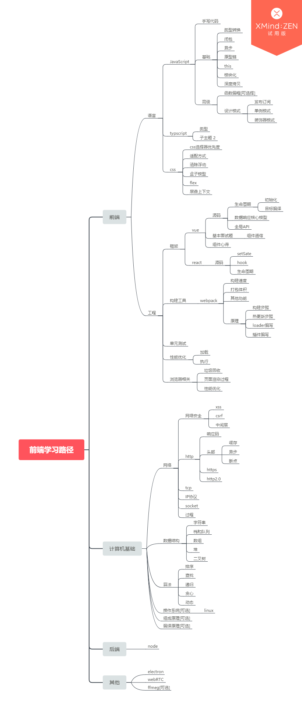

# 2019.09.09
## 极客时间网络
协议三要素
- 语法，就是这一段内容要符合一定的规则和格式。例如，括号要成对，结束要使用分号等。
- 语义，就是这一段内容要代表某种意义。例如数字减去数字是有意义的，数字减去文本一般来说就没有意义。
- 顺序，就是先干啥，后干啥。例如，可以先加上某个数值，然后再减去某个数值。

网络为何要分层，因为复杂的东西都要分层  


包在传输过程中
- 发送会不断添加包
- 接收会不断分解包

只要是网络上跑的包，都是完整，可以没有下层没上层，但是不可以没有上传没有下层  
所以TCP协议三次握手也好，重试也好，只要想发出包，就要有IP层和MAC层，不然是发不出去了的。

很像发快递的过程（http，应用层)，
- 发送
  - TCP三次握手
    - 你向顺丰下单(第一次请求),
    - 顺丰接单(应答),
    - 你向手机小伙联系(回应应答)
  - 你将消息放进盒子里(开始封装请求，会话层)
  - 快递员封装一层盒子贴上快递单带回网店(传输层）
  - 到快递点检查是否区域快件（网络层）
  - 将快件交给运输车（链路层）
  - 各个快递转运中心（物理层）
- 接收
  - 快件到达收件市转运中心（物理层），
  - 转运输车（链路层），
  - 到达区域分发（网络层），
  - 网点派送（传输层），
  - 快递员方面签收（会话层），
  - 拆开检查（表示层），
  - 收到快递（应用层）。
### IP
无类型域间选路（CIDR）

将32位IP地址一分为2，前面是网络号，后面是主机号

例子：10.100.122.2/24，这个 IP 地址中有一个斜杠，斜杠后面有个数字 24。这种地址表示形式，就是 CIDR。后面 24 的意思是，32 位中，前 24 位是网络号，后 8 位是主机号。

将子网掩码和IP地址按位计算AND，就可以得到网络号

IP 是地址，有定位功能；MAC 是身份证，无定位功能；

# 2019.09.10
研究hook
- [看完这篇，你也能把 React Hooks 玩出花](https://juejin.im/post/5d754dbde51d4561cd2466bf)
- [精读《怎么用 React Hooks 造轮子》](https://github.com/dt-fe/weekly/blob/v2/079.%E7%B2%BE%E8%AF%BB%E3%80%8AReact%20Hooks%E3%80%8B.md)

- [x] 第5讲 | 从物理层到MAC层：如何在宿舍里自己组网玩联机游戏？
- [x] 第6讲 | 交换机与VLAN：办公室太复杂，我要回学校
- [x] 第7讲 | ICMP与ping：投石问路的侦察兵

# 2019.09.11
写了几个hook
```javascript
import { useState, useCallback } from 'react'

function useInputValue(initValue) {
  let [value, setValue] = useState(initValue)
  let onChange = useCallback(event => {
    setValue(event.currentTarget.value)
  },[])
  return {
    value ,
    onChange
  }
}
export default useInputValue
```

```javascript
import { useEffect } from 'react'
// 调用mount和unmount回调
const useLifecycles = (mount:()=>void, unmount?:()=>void) => {
  useEffect(()=>{
    if (mount) {
      mount()
    }
    return () => {
      if(unmount) {
        unmount()
      }
    }
  }, [])
}
export default useLifecycles
```

```javascript
import { useEffect } from 'react'

const useMount = (fn: () => void) => {
  useEffect(() => {
    fn()
  })
}
export default useMount
```

```javascript
import { useEffect } from 'react'
const useUnmount = (fn:() => void):void => {
  useEffect(()=>{
    return () => {
      fn()
    }
  },[])
}

export default useUnmount
```
# 2019.09.12
# 2019.09.15
之前中秋休息,顺便整理一下接下来要弄的东西


完成深入浅出vue.js 的第十四章 生命周期源码阅读 192-241

# 2019.09.16
[x] 深入浅出vue.js 的第十三章 147-191 共50页
