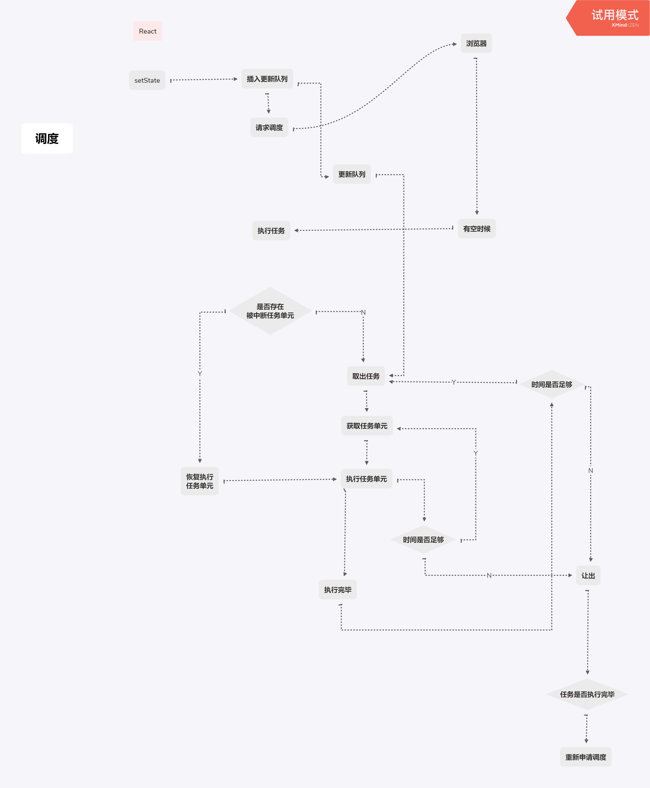
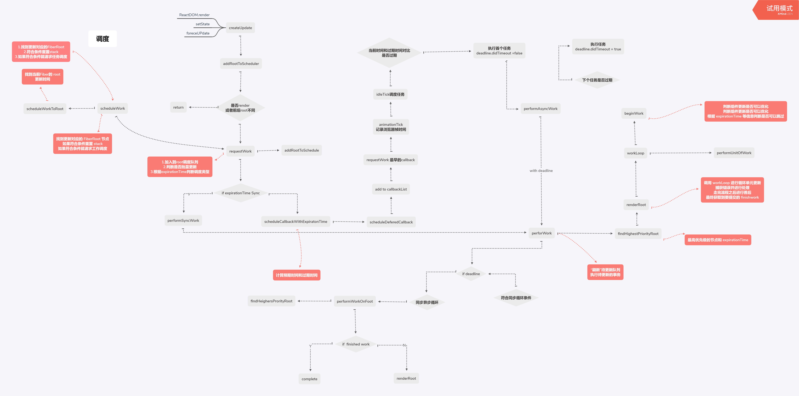

# 2019.10.31
基础
- [x] [前端开发核心知识进阶](https://gitbook.cn/gitchat/column/5c91c813968b1d64b1e08fde/topic/5cbbe639bbbba80861a35bd3)

- [x] [其他基础题库](https://gitbook.cn/gitchat/column/5c91c813968b1d64b1e08fde/topic/5cbbe675bbbba80861a35bd4)

- [x] [你真的懂 React 吗]()
- [] [从Preact中了解React组件和hooks基本原理](https://juejin.im/post/5cfa29e151882539c33e4f5e)
深入
- [x] [这可能是最通俗的 React Fiber(时间分片) 打开方式](https://juejin.im/post/5dadc6045188255a270a0f85)

主要看react fiber用的时间比较多也收获很多

# 2019.10.30
[前端开发核心知识进阶](https://gitbook.cn/gitchat/column/5c91c813968b1d64b1e08fde)

基础

- [x] 一网打尽 this，对执行上下文说 Yes
- [x] 老司机也会在闭包相关知识点翻车（上）
- [x] 老司机也会在闭包相关知识点翻车（下）

深入
- [x] [React 迈入进阶之路：核心源码解析](https://gitbook.cn/books/5c762fbfd8a65a7b063e7f28/index.html)
- [x] [如何以及为什么 React Fiber 使用链表遍历组件树
](https://juejin.im/post/5c31ffad6fb9a04a0a5f56f4)
- [x] [React Fiber 那些事: 深入解析新的协调算法](https://segmentfault.com/a/1190000017241034)
# 2019.10.29
身体不舒服
# 2019.10.28 
- [x] 整理周目标
- [x] 尝试新的饮食方法