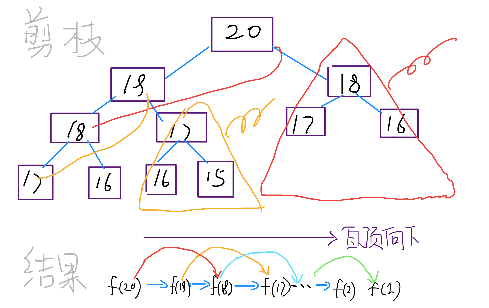

# 2019.12.13
## 46. 全排列
给定一个没有重复数字的序列，返回其所有可能的全排列。
```
输入: [1,2,3]
输出:
[
  [1,2,3],
  [1,3,2],
  [2,1,3],
  [2,3,1],
  [3,1,2],
  [3,2,1]
]

```

### 暴力解法
```javascript
var permute = function (nums) {
    // debugger
    let res = []
    let temp = []
    helper(nums, temp,res)
    return res
}
function helper (nums, temp=[],res) {
    for(let i = 0 ; i < nums.length; i++) {
        let _temp = temp.slice(0)
        if (_temp.length === nums.length - 1) {
            if (!_temp.includes(nums[i])) {
                _temp.push(nums[i])
                res.push(_temp)
                continue;
            }
        }
        if (!_temp.includes(nums[i])) {
            _temp.push(nums[i])
            helper(nums,_temp,res)
        }
    }
}
```

### 回溯解法
```javascript
var permute = function(nums) {
    let res = [] // 保存结果
    let temp = [] // 保存选择
    helper(nums, temp, res)
    return res
};
function helper (nums, temp, res) {
    if (nums.length === 0) {
        res.push(temp.slice())
    }
    for (let i = 0; i < nums.length; i++) {
        temp.push(nums[i])
        // let _temp = temp.slice()
        let copy = nums.slice()
        copy.splice(i,1)
        helper(copy,temp,res)
        temp.pop()
    }
}
```


# 2019.12.11
## 5. 最长回文子串
一个字符串 s，找到 s 中最长的回文子串。你可以假设 s 的最大长度为 1000。

```
示例 1：

输入: "babad"
输出: "bab"
注意: "aba" 也是一个有效答案。
示例 2：

输入: "cbbd"
输出: "bb"
```

### 解题
对于这个问题，我们首先应该思考的是，给一个字符串s，如何在s中找到一个回文子串？

有一个很有趣的思路：既然回文串是一个正着反着读都一样的字符串，那么如果我们把s反转，称为s'，然后在s和s'中寻找最长公共子串，这样应该就能找到最长回文子串。

比如说字符串abacd，反过来是dcaba，它俩的最长公共子串是aba，也就是最长回文子串。

但是这个思路是错误的，比如说字符串aacxycaa，反转之后是aacyxcaa，最长公共子串是aac，但是最长回文子串应该是aa。

虽然这个思路不正确，但是这种把问题转化为其他形式的思考方式是非常值得提倡的。

下面，就来说一下正确的思路，如何使用双指针。

寻找回文串的问题核心思想是：从中间开始向两边扩散来判断回文串。对于最长回文子串，就是这个意思：
```
for 0 <= i < len(s):
    找到以 s[i] 为中心的回文串
    更新答案
```
但是呢，我们刚才也说了，回文串的长度可能是奇数也可能是偶数，如果是abba这种情况，没有一个中心字符，上面的算法就没辙了。所以我们可以修改一下：


```
for 0 <= i < len(s):
    找到以 s[i] 为中心的回文串
    找到以 s[i] 和 s[i+1] 为中心的回文串
    更新答案
```
### 解题
```javascript
var longestPalindrome = function(s) {
  if(!s || s.length < 2){
      return s;
  }
  let start = 0,end = 0;
  let n = s.length;
  // 中心扩展法
  let centerExpend = (left,right) => {
      while(left >= 0 && right < n && s[left] == s[right]){
          left--;
          right++;
      }
      return right - left - 1;
  }
  for(let i = 0;i < n;i++){
      let len1 = centerExpend(i,i);
      let len2 = centerExpend(i,i+1);
      // 两种组合取最大回文串的长度
      let maxLen = Math.max(len1,len2);
      if(maxLen > end - start){
          // 更新最大回文串的首尾字符索引
          start = i - ((maxLen - 1) >> 1);
          end = i + (maxLen >> 1);
      }
  }
  return s.substring(start,end+1);
};
```

# 2019.12.10
### 前言
动态规划算法似乎是一种很高深莫测的算法，你会在一些面试或算法书籍的高级技巧部分看到相关内容，什么状态转移方程，重叠子问题，最优子结构等高大上的词汇也可能让你望而却步。

而且，当你去看用动态规划解决某个问题的代码时，你会觉得这样解决问题竟然如此巧妙，但却难以理解，你可能惊讶于人家是怎么想到这种解法的。

实际上，动态规划是一种常见的「算法设计技巧」，并没有什么高深莫测，至于各种高大上的术语，那是吓唬别人用的，只要你亲自体验几把，这些名词的含义其实显而易见，再简单不过了。

至于为什么最终的解法看起来如此精妙，是因为动态规划遵循一套固定的流程：递归的暴力解法 -> 带备忘录的递归解法 -> 非递归的动态规划解法。这个过程是层层递进的解决问题的过程，你如果没有前面的铺垫，直接看最终的非递归动态规划解法，当然会觉得牛逼而不可及了。

当然，见的多了，思考多了，是可以一步写出非递归的动态规划解法的。任何技巧都需要练习，我们先遵循这个流程走，算法设计也就这些套路，除此之外，真的没啥高深的。

以下，先通过两个个比较简单的例子：斐波那契和凑零钱问题，揭开动态规划的神秘面纱，描述上述三个流程。后续还会写几篇文章探讨如何使用动态规划技巧解决比较复杂的经典问题。

首先，第一个快被举烂了的例子，斐波那契数列。请读者不要嫌弃这个例子简单，因为简单的例子才能让你把精力充分集中在算法背后的通用思想和技巧上，而不会被那些隐晦的细节问题搞的莫名其妙。后续，困难的例子有的是。
### 步骤一、暴力的递归算法
```javascript
function fib(n) {
  if(n ===1 || n===2) return 1
  return fib(n-1) + fib(n-2)
}
```

这个不用多说了，学校老师讲递归的时候似乎都是拿这个举例。我们也知道这样写代码虽然简洁易懂，但是十分低效，低效在哪里？假设 n = 20，请画出递归树。

PS：但凡遇到需要递归的问题，最好都画出递归树，这对你分析算法的复杂度，寻找算法低效的原因都有巨大帮助。


这个递归树怎么理解？就是说想要计算原问题 f(20)，我就得先计算出子问题 f(19) 和 f(18)，然后要计算 f(19)，我就要先算出子问题 f(18) 和 f(17)，以此类推。最后遇到 f(1) 或者 f(2) 的时候，结果已知，就能直接返回结果，递归树不再向下生长了。

递归算法的时间复杂度怎么计算？子问题个数乘以解决一个子问题需要的时间。

子问题个数，即递归树中节点的总数。显然二叉树节点总数为指数级别，所以子问题个数为 O(2^n)。

解决一个子问题的时间，在本算法中，没有循环，只有 f(n - 1) + f(n - 2) 一个加法操作，时间为 O(1)。

所以，这个算法的时间复杂度为 O(2^n)，指数级别，爆炸。

观察递归树，很明显发现了算法低效的原因：存在大量重复计算，比如 f(18) 被计算了两次，而且你可以看到，以 f(18) 为根的这个递归树体量巨大，多算一遍，会耗费巨大的时间。更何况，还不止 f(18) 这一个节点被重复计算，所以这个算法及其低效。

这就是动态规划问题的第一个性质：重叠子问题。下面，我们想办法解决这个问题。

### 步骤二、带备忘录的递归解法
明确了问题，其实就已经把问题解决了一半。即然耗时的原因是重复计算，那么我们可以造一个「备忘录」，每次算出某个子问题的答案后别急着返回，先记到「备忘录」里再返回；每次遇到一个子问题先去「备忘录」里查一查，如果发现之前已经解决过这个问题了，直接把答案拿出来用，不要再耗时去计算了。

一般使用一个数组充当这个「备忘录」，当然你也可以使用哈希表（字典），思想都是一样的。
```javascript
function fib(n) {
  let map ={}
  if (n <1 ) return 0
  if(n===1|| n ===2 ) return 1
  if (map[n]) {
    return map[n-1] + map[n-2]
  } else {
    return map = fib(n-1) + fiib(n-2)
  }
}
```


实际上，带「备忘录」的递归算法，把一棵存在巨量冗余的递归树通过「剪枝」，改造成了一幅不存在冗余的递归图，极大减少了子问题（即递归图中节点）的个数。

递归算法的时间复杂度怎么算？子问题个数乘以解决一个子问题需要的时间。

子问题个数，即图中节点的总数，由于本算法不存在冗余计算，子问题就是 f(1), f(2), f(3) ... f(20)，数量和输入规模 n = 20 成正比，所以子问题个数为 O(n)。

解决一个子问题的时间，同上，没有什么循环，时间为 O(1)。

所以，本算法的时间复杂度是 O(n)。比起暴力算法，是降维打击。

至此，带备忘录的递归解法的效率已经和动态规划一样了。实际上，这种解法和动态规划的思想已经差不多了，只不过这种方法叫做「自顶向下」，动态规划叫做「自底向上」。

啥叫「自顶向下」？注意我们刚才画的递归树（或者说图），是从上向下延伸，都是从一个规模较大的原问题比如说 f(20)，向下逐渐分解规模，直到 f(1) 和 f(2) 触底，然后逐层返回答案，这就叫「自顶向下」。

啥叫「自底向上」？反过来，我们直接从最底下，最简单，问题规模最小的 f(1) 和 f(2) 开始往上推，直到推到我们想要的答案 f(20)，这就是动态规划的思路，这也是为什么动态规划一般都脱离了递归，而是由循环迭代完成计算。

### 步骤三、动态规划
有了上一步「备忘录」的启发，我们可以把这个「备忘录」独立出来成为一张表，就叫做 DP table 吧，在这张表上完成「自底向上」的推算岂不美哉！

```javascript
function fib(n) {
  let dp =[]
  dp[1] = dp[2] = 1
  for(let i = 3; i <= n; i++) {
    dp[i] = dp[i-1] + dp[i-2]
  }
  return dp[n]
}
```

画个图就很好理解了，而且你发现这个 DP table 特别像之前那个「剪枝」后的结果，只是反过来算而已。实际上，带备忘录的递归解法中的「备忘录」，最终完成后就是这个 DP table，所以说这两种解法其实是差不多的，大部分情况下，效率也基本相同。

这里，引出「动态转移方程」这个名词，实际上就是描述问题结构的数学形式：


为啥叫「状态转移方程」？为了听起来高端。你把 f(n) 想做一个状态 n，这个状态 n 是由状态 n - 1 和状态 n - 2 相加转移而来，这就叫状态转移，仅此而已。

你会发现，上面的几种解法中的所有操作，例如 return f(n - 1) + f(n - 2)，dp[i] = dp[i - 1] + dp[i - 2]，以及对备忘录或 DP table 的初始化操作，都是围绕这个方程式的不同表现形式。可见列出「状态转移方程」的重要性，它是解决问题的核心。很容易发现，其实状态转移方程直接代表着暴力解法。

千万不要看不起暴力解，动态规划问题最困难的就是写出状态转移方程，即这个暴力解。优化方法无非是用备忘录或者 DP table，再无奥妙可言。

这个例子的最后，讲一个细节优化。细心的读者会发现，根据斐波那契数列的状态转移方程，当前状态只和之前的两个状态有关，其实并不需要那么长的一个 DP table 来存储所有的状态，只要想办法存储之前的两个状态就行了。所以，可以进一步优化，把空间复杂度降为 O(1)：

```javascript
function fib(n) {
  let prev =0
  let curr =1
  for (let i=0; i <n--1; i++) {
    let sum = prev + curr
    prev = curr
    curr = sum
  }
  return curr
}
```

有人会问，动态规划的另一个重要特性「最优子结构」，怎么没有涉及？下面会涉及。斐波那契数列的例子严格来说不算动态规划，以上旨在演示算法设计螺旋上升的过程。当问题中要求求一个最优解或在代码中看到循环和 max、min 等函数时，十有八九，需要动态规划大显身手。

## 322. 零钱兑换
给定不同面额的硬币 coins 和一个总金额 amount。编写一个函数来计算可以凑成总金额所需的最少的硬币个数。如果没有任何一种硬币组合能组成总金额，返回 -1。

```
示例 1:

输入: coins = [1, 2, 5], amount = 11
输出: 3 
解释: 11 = 5 + 5 + 1
示例 2:

输入: coins = [2], amount = 3
输出: -1
```

## 思路
### 暴力解法
首先是最困难的一步，写出状态转移方程，这个问题比较好写：


其实，这个方程就用到了「最优子结构」性质：原问题的解由子问题的最优解构成。即 f(11) 由 f(10), f(9), f(6) 的最优解转移而来。

记住，要符合「最优子结构」，子问题间必须互相独立。啥叫相互独立？你肯定不想看数学证明，我用一个直观的例子来讲解。

比如说，你的原问题是考出最高的总成绩，那么你的子问题就是要把语文考到最高，数学考到最高...... 为了每门课考到最高，你要把每门课相应的选择题分数拿到最高，填空题分数拿到最高...... 当然，最终就是你每门课都是满分，这就是最高的总成绩。

得到了正确的结果：最高的总成绩就是总分。因为这个过程符合最优子结构，“每门科目考到最高”这些子问题是互相独立，互不干扰的。

但是，如果加一个条件：你的语文成绩和数学成绩会互相制约，此消彼长。这样的话，显然你能考到的最高总成绩就达不到总分了，按刚才那个思路就会得到错误的结果。因为子问题并不独立，语文数学成绩无法同时最优，所以最优子结构被破坏。

回到凑零钱问题，显然子问题之间没有相互制约，而是互相独立的。所以这个状态转移方程是可以得到正确答案的。

之后就没啥难点了，按照方程写暴力递归算法即可。

```javascript
function coinChange(coins, amount) {
  if (amount === 0) return
  let ans = amount + 1
  for(let i = 0; i < coins.length; i++) {
    if (amount - coins[i] < 0) continue;
    let subProb = coinChange(coins, amount - coins[i])
    if (subProb === -1) continue
    ans = min(ans, subProb + 1)
  }
  return ans === ans ? -1 : ans
}
```
画出递归树：


时间复杂度分析：子问题总数 x 每个子问题的时间。子问题总数为递归树节点个数，这个比较难看出来，是 O(n^k)，总之是指数级别的。每个子问题中含有一个 for 循环，复杂度为 O(k)。所以总时间复杂度为 O(k*n^k)，指数级别。

#### 二、带备忘录的递归算法

```javascript
let map = {}
function coinChange(coins, amount) {
  if (amount === 0) return
  let ans = amount + 1
  for(let i = 0; i < coins.length; i++) {
    if (amount - coins[i] < 0) continue;
    let sub = amount - coins[i]
    if (map[sub]) {
      return map[sub]
    } else {
    let subProb = coinChange(coins, sub)
    if (subProb === -1) continue
    ans = min(ans, subProb + 1)
    }
  }
  return ans === ans ? -1 : ans
}
```
不画图了，很显然「备忘录」大大减小了子问题数目，完全消除了子问题的冗余，所以子问题总数不会超过金额数 n，即子问题数目为 O(n)。处理一个子问题的时间不变，仍是 O(k)，所以总的时间复杂度是 O(kn)。

#### 三、动态规划
```javascript
var coinChange = function (coins, amount) {
  if (amount < 1) return 0;
  var dp = new Array(amount + 1).fill(amount + 1);
  dp[0] = 0;
  for (var i = 0; i <= amount; i++) {
    for (var r = 0; r < coins.length; r++) {
      if (coins[r] <= i) {
        dp[i] = Math.min(dp[i], dp[i - coins[r]] + 1);
      }
    }
  }
  return dp[amount] > amount ? -1 : dp[amount];
};
```


# 2019.12.09

## 509. 斐波那契数
斐波那契数，通常用 F(n) 表示，形成的序列称为斐波那契数列。该数列由 0 和 1 开始，后面的每一项数字都是前面两项数字的和。也就是：
```
F(0) = 0,   F(1) = 1
F(N) = F(N - 1) + F(N - 2), 其中 N > 1.
```

示例 1：

输入：2
输出：1
解释：F(2) = F(1) + F(0) = 1 + 0 = 1.
示例 2：

输入：3
输出：2
解释：F(3) = F(2) + F(1) = 1 + 1 = 2.
示例 3：

输入：4
输出：3
解释：F(4) = F(3) + F(2) = 2 + 1 = 3.
### 解题
```javascript
var fib = function(N) {
    let men = {}
    if (N <= 1) return N
    else {
        if(men[N]) {
            return men[N]
        } else {
            return  men[N] =  fib(N-1) + fib (N - 2)
        }
    } 
};
```

## 70. 爬楼梯
假设你正在爬楼梯。需要 n 阶你才能到达楼顶。

每次你可以爬 1 或 2 个台阶。你有多少种不同的方法可以爬到楼顶呢？

注意：给定 n 是一个正整数。
```
输入： 2
输出： 2
解释： 有两种方法可以爬到楼顶。
1.  1 阶 + 1 阶
2.  2 阶
```

```
输入： 3
输出： 3
解释： 有三种方法可以爬到楼顶。
1.  1 阶 + 1 阶 + 1 阶
2.  1 阶 + 2 阶
3.  2 阶 + 1 阶
```
### 思路 
解决方案
方法一：暴力法
算法

在暴力法中，我们将会把所有可能爬的阶数进行组合，也就是 1 和 2 。而在每一步中我们都会继续调用 climbStairsclimbStairs 这个函数模拟爬 11 阶和 22 阶的情形，并返回两个函数的返回值之和。

climbStairs(i,n)=(i + 1, n) + climbStairs(i + 2, n)
climbStairs(i,n)=(i+1,n)+climbStairs(i+2,n)

其中 ii 定义了当前阶数，而 nn 定义了目标阶数。

方法二：动态规划
算法

不难发现，这个问题可以被分解为一些包含最优子结构的子问题，即它的最优解可以从其子问题的最优解来有效地构建，我们可以使用动态规划来解决这一问题。

第 ii 阶可以由以下两种方法得到：

在第 (i-1)(i−1) 阶后向上爬一阶。

在第 (i-2)(i−2) 阶后向上爬 22 阶。

所以到达第 ii 阶的方法总数就是到第 (i-1)(i−1) 阶和第 (i-2)(i−2) 阶的方法数之和。

令 dp[i]dp[i] 表示能到达第 ii 阶的方法总数：

dp[i]=dp[i-1]+dp[i-2]
dp[i]=dp[i−1]+dp[i−2]

### 解题
递归
```javascript
var climbStairs = function(n) {
  let mem = {}
  // debugger
  if (n<=2) return n 
  if (mem[n]) {
    return mem[n]
  } else {
    return mem[n] = climbStairs(n-1) + climbStairs(n-2)
  }
};
```

动态规划
```javascript
var climbStairs = function(n) {
  let dep = {}
  for(let i = 0; i <= n; i++) {
    // debugger
    if (i <=2) {
      dep[i] = i
    } else {
      dep[i] = dep[i-1] + dep[i-2]
    }
  }
  return dep[n]
};
```

## 120. 三角形最小路径和
给定一个三角形，找出自顶向下的最小路径和。每一步只能移动到下一行中相邻的结点上。

例如，给定三角形：
[
     [2],
    [3,4],
   [6,5,7],
  [4,1,8,3]
]

### 思路
1. 特判，若triangletriangle为空，返回00，若只有一层len(triangle)==1len(triangle)==1，返回元素。
2. 从第二行开始，遍历区间[1,n)[1,n)：
  - 对每一层的元素进行遍历，遍历区间[0,len(triangle[i]))[0,len(triangle[i]))，存在三种情况：
    - 每一行的首位，triangle[i][j]+=triangle[i-1][j]triangle[i][j]+=triangle[i−1][j]，等于上一行的相同索引处。
    - 每一行的末位，triangle[i][j]+=triangle[i-1][j-1]triangle[i][j]+=triangle[i−1][j−1]，等于上一行的前一位处。
    - 对于其他元素，triangle[i][j]+=min(triangle[i-1][j-1],triangle[i-1][j])triangle[i][j]+=min(triangle[i−1][j−1],triangle[i−1][j])，等于上一行中相邻的较小值加上自身。
3. 返回最后一行中的最小路径和


### 解题
```javascript
var minimumTotal = function(triangle) {
    let mini = []
    mini[triangle.length - 1] = triangle[triangle.length - 1]
    for (let i = triangle.length -2; i >=0; --i) {
      if (!mini[i]) {
        mini[i] = []
      }
      for(let j = 0; j < triangle[i].length; j++) {
        mini[i][j] = triangle[i][j] + Math.min(mini[i+1][j], mini[i+1][j+1])
      }
    }
    return mini[0][0] 
};
```


