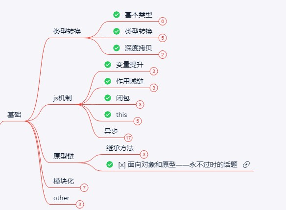
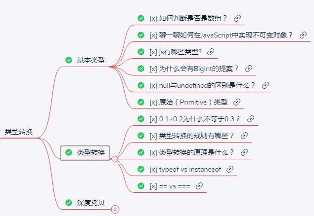
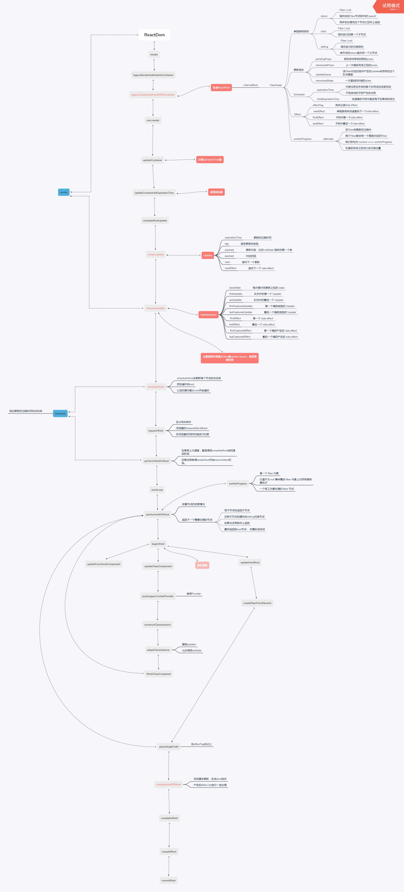
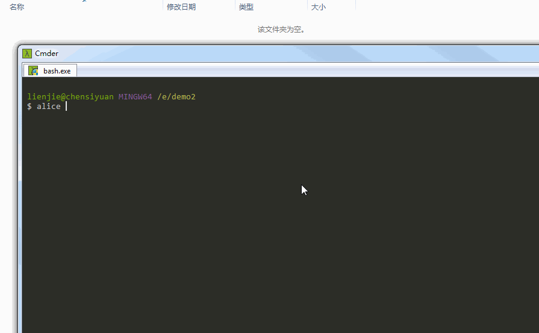
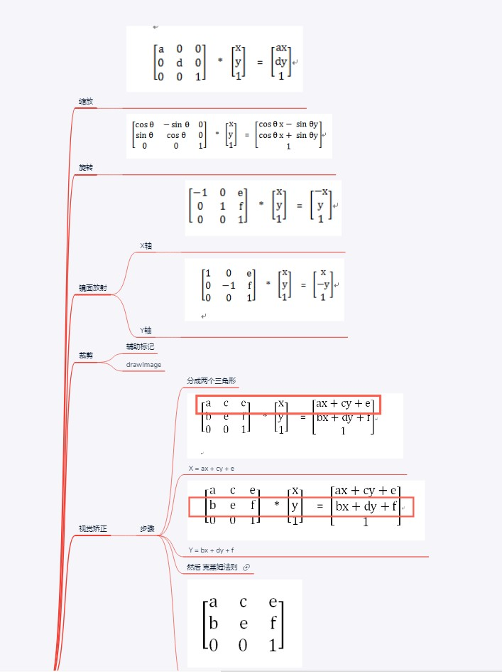
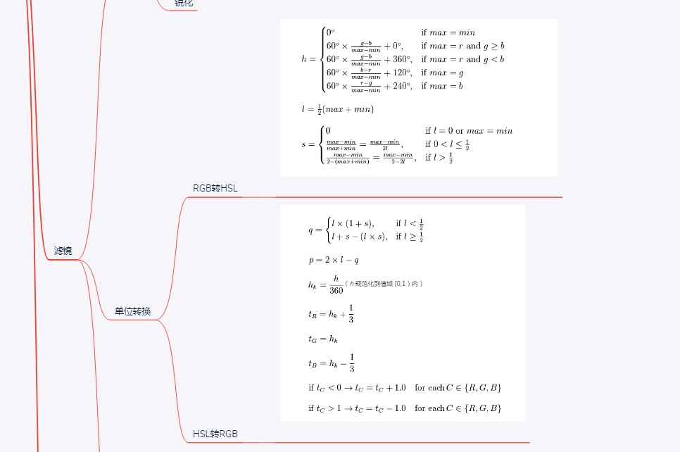

# 2019学习学到失恋但是还要继续学习记|2019 与我的技术之路
## 序言
不知不觉又过一年，这一年过得真快，发生很多事情，但是对我影响最大还是如题所示。失恋可不是一件让人炫耀的事情，而且我想换别的有意思的标题如《非科班渣渣速通WEB中级前端攻略》、《2019天天加班下如何从80公斤胖子减肥到70斤》，但是还是现在这个标题能体现我现在内心的心情，感情方面情况比较复杂后文会说，现在先来点干货。

本文文章会比较多，但是你能从本文中获取到
- 一份本人亲自走过的技术地图，能帮助你快速成长，解决成长迷茫
- 帮助初级工程师快速成长到中级工程
- 非科班学生如何弥补计算机基础
- 如何在加班严重情况下保持高效工作与学习
- 如何在加班严重情况下，尽量保持健康，甚至减肥

希望能耐心看完，或者按自己所需选择观看

## 技术篇
其实技术我也一般般，想了解我的人可以看我上一年写的年度[一位前端 2018 绝地求生记 | 掘金年度征文](https://juejin.im/post/5c36fe50518825253b5e94f4)，如果不想看，那么简单可以概括成以下标签。`非科班`，`艺术转行`，`毕业后考研失败才学前端`，工作时间|接触前端时间才`600天`，以上每个标签都是十分致命，对于HR来说可能这人的简历看几下就下一个，好像也没资格像别人大牛一样分享。但是，我坚信一点就是技术是公平的，只要你肯学习，肯用时间，并且学习方式比较科学就会有回报，一下是我如何从初级走上中级所学所做的事情。

（至于如何从零到初级前端还是可以参考过去我写的[文章](https://juejin.im/post/5c36fe50518825253b5e94f4),里面包含如何学javascript，vue如何入门，刻意练习等，这里就不重复了）

### 前端知识的广度
由于前端涉及知识量真的十分广，但是上班搬砖涉及东西却比较狭窄，就会出现一个奇怪的现象。对于有些应届生面试都知道的东西工作某些人工作2-3年的人却不知道。如xss攻击，浏览器缓存策略等。我觉得造成这种情况有以下原因。
1. 缓存策略一般都是运维负责，对于前端来说，写好业务就行。
2. 业务繁重，缺乏学习的时间和动力
3. 想学习，但是缺乏系统规范，只能出了问题再去百度学习，没有出问题就不会想去了解。

那么如何防止应届生“吊打”老员工这种尴尬的局面，其实最简单实在的办法就是像应届生一样，看大厂面什么，就去学什么，俗称“背面经”。在这里大家就可能不爽，怎么搞得这么功利化，像应试教育学习能学到东西的疑问。然而你不得不服，应试教育确实人类掌握大量杂乱知识最快最简单的办法。“背面经”能让你快速了解前端需要掌握什么东西，快速搭建知识框架，但是最悲哀的是很多人背完就没有下文，这真的是像应试教育一样，啥都没学到的。

那么如何科学习，可以先遵循以下方法

1. 寻找被人整理好的知识图谱，先不看里面的细节，而且看整体的框架。（知识图谱我已经收集整理好）这一步是为了让你知道将来要学啥，就像看一本书的目录一样。
2. 按照目录整理出思维导图，如javascript基础可以先整理成思维导图,这些都是比较经常问到的东西，为后面第三做铺垫。

3. 开始大量看相关同类的问题，同时要细节深入,把看过的东西融入知识图谱里面。如基本类型可以涉及一下的东西。

4. 一个一个专栏攻破，并且找到他们之间的关联。如闭包问题就会涉及到 函数调用栈，作用域链，垃圾清除等。promise 就会和浏览器的event loop相关联。当你理顺他们之间的关系之后，从新理顺一下思维导图。
5. 不断重复上面的。

如果把上面的行为当做比喻的话，那就像做沙雕一样。知识点是沙零散的，，就像用水把沙变成粘稠状态，然后再按照自己的喜欢造出形状，这就是我们用脑子和用手去实践。

干货推荐：

先做一份自我检测，[一名【合格】前端工程师的自检清单](https://juejin.im/post/5cc1da82f265da036023b628#heading-20)。然后根据 自己薄弱点去看相关资料。

BLOG:
- [前端进阶之道](https://yuchengkai.cn/docs/frontend/) 
- [前端面试与进阶指南](https://www.cxymsg.com/)
- [ConardLi的blog](http://www.conardli.top/blog/)
- [木易杨前端进阶](https://www.muyiy.cn/)
- [FE-Interview](http://blog.poetries.top/FE-Interview-Questions/)
- [冴羽的博客](https://github.com/mqyqingfeng/Blog)  

掘金好文章
- [(1.6w字)浏览器与前端性能灵魂之问，请问你能接得住几个？（上）](https://juejin.im/post/5df5bcea6fb9a016091def69)
- [(建议收藏)原生JS灵魂之问, 请问你能接得住几个？(上)](https://juejin.im/post/5dac5d82e51d45249850cd20)
- [(建议精读)原生JS灵魂之问(中)，检验自己是否真的熟悉JavaScript？](https://juejin.im/post/5dbebbfa51882524c507fddb)
- [(2.4w字,建议收藏)😇原生JS灵魂之问(下), 冲刺🚀进阶最后一公里(附个人成长经验分享)](https://juejin.im/post/5dd8b3a851882572f56b578f)
- [中高级前端大厂面试秘籍，为你保驾护航金三银四，直通大厂(上)](https://juejin.im/post/5c64d15d6fb9a049d37f9c20)
- [(中篇)中高级前端大厂面试秘籍，寒冬中为您保驾护航，直通大厂](https://juejin.im/post/5c92f499f265da612647b754)
- [(下篇)中高级前端大厂面试秘籍，寒冬中为您保驾护航，直通大厂](https://juejin.im/post/5cc26dfef265da037b611738)


付费好东西：

对知识付费其实是好事情，站在巨人的肩膀上看东西才会远。
- [前端面试之道](https://juejin.im/book/5bdc715fe51d454e755f75ef) |比较基础的前端知识，适合新人
- [前端开发核心知识进阶](https://gitbook.cn/gitchat/column/5c91c813968b1d64b1e08fde)| 从基础出发，由浅入深，还有关于很多工程方面的文章，十分推荐。
- [浏览器工作原理与实践](https://time.geekbang.org/column/intro/216) |这个也是个人十分推荐，因为本人看过webkit技术揭秘，发现很多东西都是讲浏览器一些实现方式，一堆C++十分难受，但是这个专栏却用十分简单生动的方式来讲述浏览器本质，个人收获很多。

虽然只有短短几个链接，但是里面的东西起码看半年以上才看得完。注意这里的看完不是简单的看过一遍有印象，而是要成为自己知识库的一部分。


### 前端深度
初级、中级、高级之间的区别是什么，是工作时间吗，还是掌握知识的多少。个人觉得是问题的深度，是否能一眼看透事物的本质，而本质是没法通过语言描述，或者教学直接传授的，要通过大量知识学习，不断提问题，不断思考，不断反复认证才能获得看透事物本质的能力，我现在也只能叫半只脚入门。接下深度的路来就不像之前前端广度那么好走，有一堆人一堆文章带着你走，甚至可能很多事情只能自己探索。

前端深度的第一步还是明确目标，你想往哪个方向走，有node全栈，webGL图形处理，有框架源码等等。我个人选择一条比较大众或者大家都要经历的道路，就是框架源码。不过这条路带给我直接受益最大。以下例子可以简单说明。

1. 第一件事情就是当你比较了解vue.js的时候，去转react框架会非常快。目前这家公司由于历史原因，会出现一个部门里面，有些项目是用vue，有些项目是react。有次项目比较急，需要临时把我调过去支援。那时候我刚入职没多久，还是在用vue，对于react一点接触的没有，之前面试也因为技术栈不匹配把我拒绝，所以对react还是有阴影。当时真的想死的心都有，基本上都是把官网教程看了一下，然后自己弄了一些小demo，连书都没看完就要直接开干了。jsx怎么这么奇怪，为何react没有像vue的`$emit`，一堆问题。不过由于对vue比较了解，我猜测react 也是当setState的时候触发视图更新，然后进入diff比较，最后替换。按照对vue的理解，强行瞎写代码，最后还是完成交付。现在回想起来，有两个感想。一个是幸好对vue理解比较深，而且也有大量编程经验，切换框架比较快，不用像学vue一样重新看视频，按照视频敲demo，直接经验借鉴。第二是由于抱着vue的思想去写react，会出现很多问题，如setState异步问题，会让我以后去研究react时候抱着很多问题，不会像学vue，把源码看完就完事，而是去想了解为何要这样设计，vue这样设计的好处是怎么样，react这样设计的好处是怎么样，抱着这些问题去看别人文章，看源码效率更快


2. 第二件事是十分戏剧性，因为我对react了解深入了，也写过一些hook，然后去玩vue3.0的时候，基本把文档看一遍之后就立刻上手了。（知识点补充，vue3 放弃了传统的class编程，使用函数编程，以前的data，created，watch等东西就无法使用，对于学习vue不深入的，可能就是基本重学，所以这举措出来，大家反响十分剧烈，被称为vue史上最黑暗的一天）其实对于我来说这改变挺好的，因为react的hook真的用的很爽，甚至我切换来写vue的时候没hook用有点不习惯。虽然vue3和react hook有本质上的区别，但是写法起来还是挺相似，切换起来挺顺的，对于一个早上写vue项目，下午写react项目的人来说福音吧。

3. 身边一个前端同事工作时间算比较久，觉得需要在前端之外发展一下，所以学一下Java，我看他就随便看一下教程，然后几个星期后告诉我，基本把公司后端Java项目看完，写得真臃肿，他觉得他现在自己写的东西比他们还好。。。那时候有点震惊，不过现在刷leetcode的时候，看别人解题很多都是Java，确实我没学过Java，但是基本看得懂他思路，或许是语言的相通点吧。

4. 某天和一个大牛吹水，那位大牛是原阿里现在字节跳动，我问他为何字节跳动这么重视基础，业务东西一点不问。他给我讲了个例子，字节跳动不像阿里有这么重历史负担，一堆祖传代码，所以他们使用技术栈可能会比较“偏激”，使用比较前沿的技术，所以每个进去之后可能都是一张白纸，从零学起。他有个同事是写了4年Java，进去之后立刻要转GO语音，他确实只用一个星期多一点就转过来，并且顺利开展业务开发。这就是基础好，经验丰富，看事情有深度导致学得快。

以上四个事情基于我一个启发，哪怕你能看透一丢丢事物的本质，那么你学新东西的速度是飞快的。现在技术更新快，前端特别明显，vue3要出，webpack5要出，框架又vue又react，大家都说学不动，但是其实很多东西的本质还是没有变的,vue3还是MVVM模型，wepback5只不过打包速度更快，配置更加轻量级。vue和react虽然有很多不同之处，但是他们也会相互借鉴，写法也越来越相似。

以上说那么，就是想说明，如果不深入学习研究，其实业务逻辑大家都写的差不多，但是深入过的处理bug，性能优化，学习新技术就是比没有深入的人强。因为深入了，定位问题和开发效率提高了，有更多时间研究，因为有更多时间，所以研究得更透彻，这是个良性循环，所以有些人一直成长，有些人原地踏步，甚至被时代所抛弃。

上面说那么，那么如何去看源码，我觉得可以遵循以下步骤

1. 先有大量的项目经验，对框架api非常熟悉下才能开始看源码。你连框架都没用好，就想看源码。就像勇者没刷出圣剑直接去打BOSS，下场可想而知。

2. 一开始不要直接上来就看代码和细节，这个我吃了两次亏。在看vue的时候，直接就去看慕课网的[Vue.js源码全方位深入解析](https://coding.imooc.com/class/chapter/228.html#Anchor)看得我一脸懵逼，我是谁，我在哪里，我要干什么，后来我调整策略，先去做下面步骤，回来在看视频才豁然开朗。后来我视频都没耐心看，直接自己把剩下都看了，觉得看源码也不过如此，后来去看react源码，一开始还好，能看懂，后来看到`reconciliation`,2K行代码，而且贼复杂，又开始质疑人生了，那是因为我在没了解fiber概念之前就看，当然看不懂。

3. 先去看别人写的文章，第一遍看的时候不需要太过关注细节，知道一些概念就好，第二次看的时候，基本知道执行流程，第三次看的时候按照作者手写一下最简单的demo

vue为例子：

先看[剖析 Vue.js 内部运行机制](https://juejin.im/book/5a36661851882538e2259c0f),手把手教你如何写一个最小mvvm模式，mvvm是最核心的思想。当年能懂下面的图时候,那么可以进入下一步了


react为例子

react玩家就比较惨了，因为不得不承认，react的代码量大，实现比较复杂，特别是fiber真的是难。比起看vue源码，难度上了几个台阶，但是无奈之举，之后会说道。

先来个简单的

[React.js 小书](http://huziketang.mangojuice.top/books/react/)先来简单实现一个mvc模型的react吧。

然后react最难就是fiber，fiber的代码实现十分复杂，这时候无需太过关注代码，只需要知道，fiber是解决什么问题而诞生，以及相关的概念就好

推荐按以下顺序阅读文章
  1.  [这可能是最通俗的 React Fiber(时间分片) 打开方式](https://juejin.im/post/5dadc6045188255a270a0f85) 这文章如标题，真是最通俗易懂。

  2. [Deep In React之浅谈 React Fiber 架构](https://mp.weixin.qq.com/s/dONYc-Y96baiXBXpwh1w3A)

  3. [Fiber 内部: 深入理解 React 的新 reconciliation 算法](https://zhuanlan.zhihu.com/p/59055212)

  4. [如何以及为什么 React Fiber 使用链表遍历组件树](https://juejin.im/post/5c31ffad6fb9a04a0a5f56f4)

有能力者，可以直接科学上网看原文吧

  1. [Lin Clark - A Cartoon Intro to Fiber - React Conf 2017](https://www.youtube.com/watch?v=ZCuYPiUIONs)

  2. [Inside Fiber: in-depth overview of the new reconciliation algorithm in React](https://medium.com/react-in-depth/inside-fiber-in-depth-overview-of-the-new-reconciliation-algorithm-in-react-e1c04700ef6e)

  3. [In-depth explanation of state and props update in React](https://medium.com/react-in-depth/in-depth-explanation-of-state-and-props-update-in-react-51ab94563311)

  4. [The how and why on React’s usage of linked list in Fiber to walk the component’s tree](https://medium.com/react-in-depth/the-how-and-why-on-reacts-usage-of-linked-list-in-fiber-67f1014d0eb7)

  5. [Practical application of reverse-engineering guidelines and principles](https://medium.com/react-in-depth/practical-application-of-reverse-engineering-guidelines-and-principles-784c004bb657?source=collection_home---4------3-----------------------)

知道看懂以下图时候，就可以下一个阶段了


4. 这时候就可以关注代码细节了

vue玩家：

《深入浅出Vue.js》， 这本书真的好，作者每单介绍一个部分的时候，都会由最简单抽象的一个demo，一步一步变成框架实际的样子，最后拿你写的demo和框架实际的对比，分析双方优缺点。


虽然这书介绍vue很多核心东西，但是对于router，vuex，slot，keep-alive没有介绍到，可以看[Vue.js源码全方位深入解析](https://coding.imooc.com/class/chapter/228.html#Anchor)做补充。电子书：[ 《Vue.js 源码揭秘》](https://ustbhuangyi.github.io/vue-analysis/)

基本上vue做到这里就算可以了

react玩家：

先别直接全部看源码，来解决以下问题才开始吧（以下问题出自[前端开发核心知识进阶18/51你真的懂 React 吗](https://gitbook.cn/gitchat/column/5c91c813968b1d64b1e08fde/topic/5cbbefcebbbba80861a35c29)）

问题1：

在react中
```javascript
function handleClick(e) {
  console.log(e)

  setTimeout(() => {
    console.log(e)
  }, 0)
}
```

上述代码第二个 console.log 总将会输出 undefined。

为此 React 也贴心的为我们准备了持久化合成事件的方法：

```javascript
function handleClick(e) {
  console.log(e)

  e.persist()

  setTimeout(() => {
    console.log(e)
  }, 0)
}
```

问题2：

在 React 中，直接使用 e.stopPropagation 不能阻止原生事件冒泡，因为事件早已经冒泡到了 document 上，React 此时才能够处理事件句柄。
```javascript
componentDidMount() {
  document.addEventListener('click', () => {
    console.log('document click')
  })
}

handleClick = e => {
  console.log('div click')
  e.stopPropagation()
}

render() {
  return (
    <div onClick={this.handleClick}>
      click
    </div>
  )
}
```
执行后会打印出 div click，之后是 document click。e.stopPropagation 是没有用的

解决办法如下：

```javascript
componentDidMount() {
  document.addEventListener('click', () => {
    console.log('document click')
  })
}

handleClick = e => {
  console.log('div click')
  e.nativeEvent.stopImmediatePropagation()
}

render() {
  return (
    <div onClick={this.handleClick}>
      click
    </div>
  )
}
```

问题三，setState同步异步问题，能清晰react的setState后步骤是如何，你知道为何react要这样设计

以上问题一和二是react的事件机制

可以参考
- [【React深入】React事件机制](https://segmentfault.com/a/1190000018391074)
- [谈谈React事件机制和未来(react-events)](http://www.feingto.com/?p=11049)


问题三是react调度机制,可以参考

- [【React深入】setState的执行机制](https://segmentfault.com/a/1190000018260218)

- [再谈react setState-setState如何处理更新？](https://zhuanlan.zhihu.com/p/52052584)

然后来个看源码热身，看yck大大的react源码解析，只有热身最好，最后去看完整源码才不会这么挫败。

yck系列

- [剖析 React 源码：先热个身](https://juejin.im/post/5cbae9a8e51d456e2809fba3)
- [剖析 React 源码：render 流程（一）](https://juejin.im/post/5cca5ad2e51d456e6154b4c7)
- [剖析 React 源码：render 流程（二）](https://juejin.im/post/5ce21cfb6fb9a07eec599b9f)
- [剖析 React 源码：调度原理](https://juejin.im/post/5cef5392e51d4510727c801e)
- [剖析 React 源码：组件更新流程（一）](https://juejin.im/post/5d25ec85f265da1bd605cd9d)

热身做完，直接上战场吧

视频：[React源码深度解析 高级前端工程师必备技能](https://coding.imooc.com/class/309.html)

电子书： [React 源码解析](https://react.jokcy.me/)

真心话，我研究了这么久，还没看完。。。

可能有点错误，但是大概就是这个流程吧



5. 自己的思考
在看源码的时候，我会有以下疑问


- 为何vue没有像react有shouldComponentUpdate
- 为何vue没有像react使用fiber时间切片
- 为何vue使用的是模板编写，react使用jsx
- vue和react的diff区别是什么
- vue和react生命周期相同和不同之处在哪里
- vue和react事件处理的区别是什么，为何react要使用自己一套事件机制
- 为何react的setState要设计异步

以上我都是不断自己看源码不断给自己提问，不断自我解答或者寻求答案。

## 工作
### 工作技术与项目
由于公司扩张飞快，十分缺人，公司框架又没有统一，会存在jQuery，JSP，VUE，REACT项目。经常会处于早上写vue，下午写react，晚上写electron，这种尴尬局面，不过也因此技术成长也飞快。以下有三个项目然我十分自豪

#### 61tpl-cli
由于公司vue，react项目都有，就会出现一些项目是vue-cli2生成出来，有些是vue-cli3生成出来，还有些是create-react-app生成出来，为了业务或者想做dll时候，改起来十分难受，也对业务开发不友好。而且很多项目太过庞大，构建效率低下。基于以上痛点我决定开发一套脚手架。
以下是大概功能
1. 支持react和vue框架
2. 有webpack和rollup选择
3. 支持javascript或者typescript
4. 境选择： 本地、开发、测试、生产、灰度、预发布
5. 选择移动端时候，有做适配方案，安卓4.4.0兼容
6. electron框架开箱即用
7. 每个模板都有做性能优化，手段有dll，多线程打包等等
8. 统一配置，配置名称仿照vue-cli2，vue用户立刻上手，react用户也会很快上手 



#### H5图片编辑器
仿照小红书，能对图片进行裁剪、缩放、旋转、镜像对称、视觉矫正、添加固定小icon，画笔，小红书图片标签关联、图片调色、图片锐化等等。这个项目最大成就是性能做到极致，一开始是由一堆插件如vue-crop等组件临时组合，没当一个功能完成后都会通过html2canvas这个插件合成新的处理图片，然后再进行下一步处理。而html2canvas是十分吃性能就算了，还会合成图片失败，变成黑屏？？？？

那么只能移除html2canvas，把全部插件的核心都抽出来，就顺便复习一下





