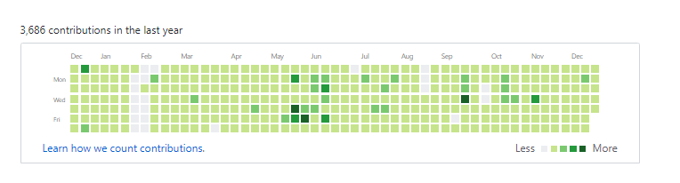
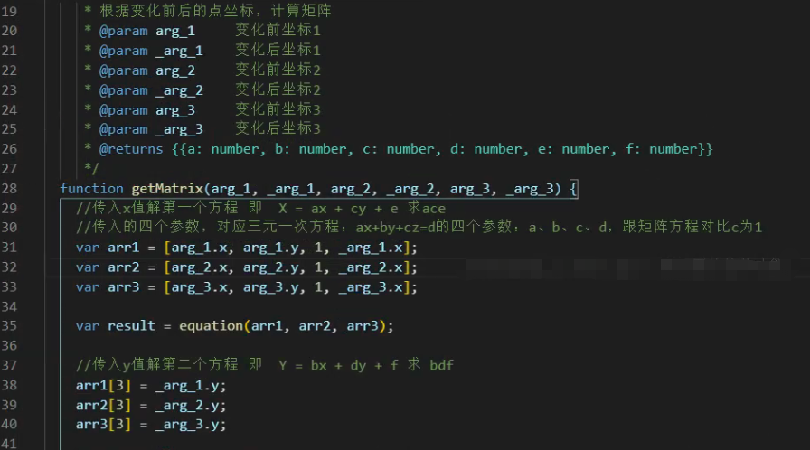
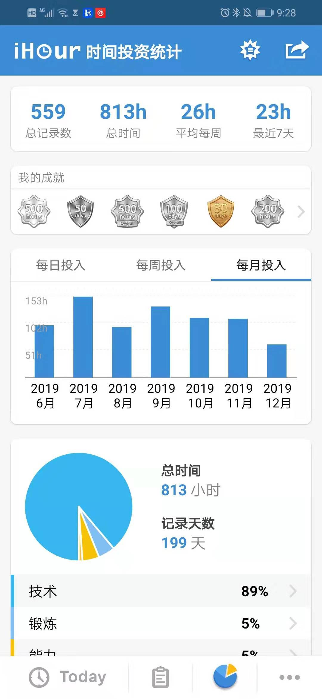
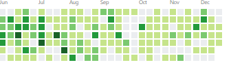
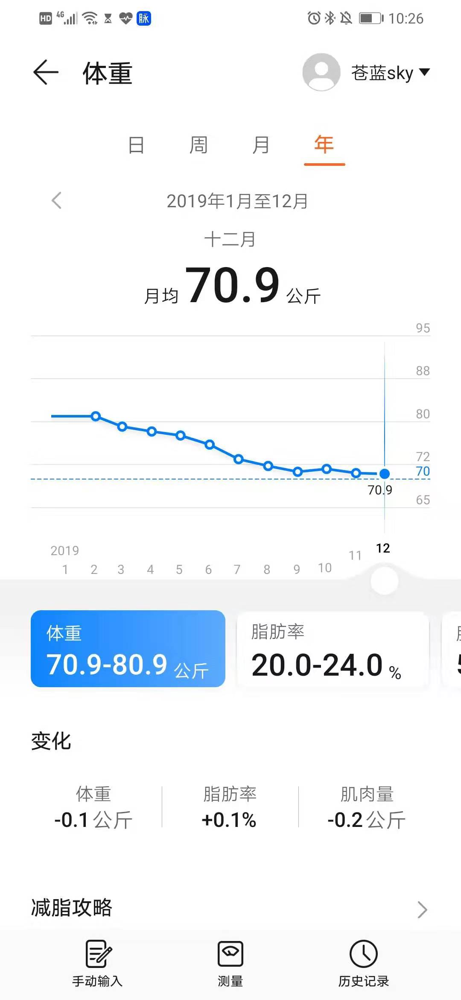

# 2019学习学到失恋但是还要继续学习记|2019 与我的技术之路
  ## 序言
不知不觉又过一年，这一年过得真快，发生很多事情，但是对我影响最大还是如题所示。失恋可不是一件让人炫耀的事情，虽然我想换别的有意思的标题如《非科班渣渣如何速通WEB中级前端攻略》、《2019天天加班下如何从80公斤胖子减肥到70斤》，但是还是现在这个标题能体现我现在内心的心情，感情方面情况比较复杂后文会说，现在先来点干货。

本文文章会比较多，但是你能从本文中获取到
- 一份本人亲自走过的技术地图，能帮助你快速成长，解决成长迷茫
- 帮助初级工程师快速成长到中级工程
- 非科班学生如何弥补计算机基础
- 如何在加班严重情况下保持高效工作与学习
- 如何在加班严重情况下，尽量保持健康，甚至减肥

希望能耐心看完，或者按自己所需选择观看

## 技术篇
其实技术我也一般般，想了解我的人，可以看我上一年写的年度[一位前端 2018 绝地求生记 | 掘金年度征文](https://juejin.im/post/5c36fe50518825253b5e94f4)，如果不想看，那么简单可以概括成以下标签。`非科班`，`艺术转行`，`考研失败`,`毕业后才学前端`，`600天前端工作经验`，以上每个标签都是十分致命，对于HR来说，可能这人的简历看几下就下一个，虽然这么说好像也没资格像别人大牛一样分享。但是，我坚信一点就是技术是公平的，只要你肯学习，肯用时间，并且学习方式比较科学就会有回报，接下来介绍是我如何从初级走上中级所学所做的事情。

（至于如何从零到初级前端还是可以参考过去我写的[文章](https://juejin.im/post/5c36fe50518825253b5e94f4),里面包含如何学javascript，vue如何入门，刻意练习等，这里就不重复了）

### 前端知识的广度
由于前端涉及知识量真的十分广，但是上班搬砖涉及东西却比较狭窄，就会出现一个奇怪的现象。对于有些应届生面试都知道的东西工作某些人工作2-3年的人却不知道。如xss攻击，浏览器缓存策略等。我觉得造成这种情况有以下原因。
1. 缓存策略一般都是运维负责，对于前端来说，写好业务就行。
2. 业务繁重，缺乏学习的时间和动力
3. 想学习，但是缺乏系统规范，只能出了问题再去百度学习，没有出问题就不会想去了解。

那么如何防止应届生“吊打”老员工这种尴尬的局面，其实最简单实在的办法就是像应届生一样，看大厂面什么，就去学什么，俗称“背面经”。在这里大家就可能不爽，怎么搞得这么功利化，像应试教育学习能学到东西的疑问。然而你不得不服，应试教育确实人类掌握大量杂乱知识最快最简单的办法。“背面经”能让你快速了解前端需要掌握什么东西，快速搭建知识框架，但是最悲哀的是很多人背完就没有下文，这真的是像应试教育一样，啥都没学到的。

那么如何科学习，可以先遵循以下方法

1. 寻找被人整理好的知识图谱，先不看里面的细节，而且看整体的框架。（知识图谱我已经收集整理好）这一步是为了让你知道将来要学啥，就像看一本书的目录一样。
2. 按照目录整理出思维导图，如javascript基础可以先整理成思维导图,这些都是比较经常问到的东西，为后面第三做铺垫。

3. 开始大量看相关同类的问题，同时要细节深入,把看过的东西融入知识图谱里面。如基本类型可以涉及一下的东西。

4. 一个一个专栏攻破，并且找到他们之间的关联。如闭包问题就会涉及到 函数调用栈，作用域链，垃圾清除等。promise 就会和浏览器的event loop相关联。当你理顺他们之间的关系之后，从新理顺一下思维导图。
5. 不断重复上面的。


干货推荐：

先做一份自我检测，[一名【合格】前端工程师的自检清单](https://juejin.im/post/5cc1da82f265da036023b628#heading-20)。然后根据 自己薄弱点去看相关资料。

BLOG:
- [前端进阶之道](https://yuchengkai.cn/docs/frontend/) 
- [前端面试与进阶指南](https://www.cxymsg.com/)
- [ConardLi的blog](http://www.conardli.top/blog/)
- [木易杨前端进阶](https://www.muyiy.cn/)
- [FE-Interview](http://blog.poetries.top/FE-Interview-Questions/)
- [冴羽的博客](https://github.com/mqyqingfeng/Blog)  

掘金好文章
- [(1.6w字)浏览器与前端性能灵魂之问，请问你能接得住几个？（上）](https://juejin.im/post/5df5bcea6fb9a016091def69)
- [(建议收藏)原生JS灵魂之问, 请问你能接得住几个？(上)](https://juejin.im/post/5dac5d82e51d45249850cd20)
- [(建议精读)原生JS灵魂之问(中)，检验自己是否真的熟悉JavaScript？](https://juejin.im/post/5dbebbfa51882524c507fddb)
- [(2.4w字,建议收藏)😇原生JS灵魂之问(下), 冲刺🚀进阶最后一公里(附个人成长经验分享)](https://juejin.im/post/5dd8b3a851882572f56b578f)
- [中高级前端大厂面试秘籍，为你保驾护航金三银四，直通大厂(上)](https://juejin.im/post/5c64d15d6fb9a049d37f9c20)
- [(中篇)中高级前端大厂面试秘籍，寒冬中为您保驾护航，直通大厂](https://juejin.im/post/5c92f499f265da612647b754)
- [(下篇)中高级前端大厂面试秘籍，寒冬中为您保驾护航，直通大厂](https://juejin.im/post/5cc26dfef265da037b611738)


付费好东西：

对知识付费其实是好事情，站在巨人的肩膀上看东西才会远。
- [前端面试之道](https://juejin.im/book/5bdc715fe51d454e755f75ef) |比较基础的前端知识，适合新人
- [前端开发核心知识进阶](https://gitbook.cn/gitchat/column/5c91c813968b1d64b1e08fde)| 从基础出发，由浅入深，还有关于很多工程方面的文章，十分推荐。
- [浏览器工作原理与实践](https://time.geekbang.org/column/intro/216) |这个也是个人十分推荐，因为本人看过webkit技术揭秘，发现书上很多东西都是讲浏览器一些实现方式，一堆C++十分难受，但是这个专栏却用十分简单生动的方式来讲述浏览器本质，个人收获很多。

虽然只有短短几个链接，但是里面的东西起码看半年以上才看得完。注意这里的看完不是简单的看过一遍有印象，而是要成为自己知识库的一部分。


### 前端深度
初级、中级、高级之间的区别是什么，是工作时间吗，还是掌握知识的多少。个人觉得是看问题的深度，是否能一眼看透事物的本质，而本质是没法通过语言描述，或者教学直接传授的，要通过大量知识学习，不断提问题，不断思考，不断反复认证才能获得看透事物本质的能力，我现在也只能叫半只脚入门。接下深度的路来就不像之前前端广度那么好走，有一堆人一堆文章带着你走，甚至可能很多事情只能自己探索。

前端深度的第一步还是明确目标，你想往哪个方向走，有node全栈，webGL图形处理，有框架源码等等。我个人选择一条比较大众或者大家都要经历的道路，就是框架源码。

那么为要深入，做一个API的搬砖工不好吗，那么我想给大家讲4个故事，让大家启发启发

1. 第一件事情就是当你比较了解vue.js的时候，去转react框架会非常快。目前这家公司由于历史原因，会出现一个部门里面，有些项目是用vue，有些项目是react。有次项目比较急，需要临时把我调过去支援。那时候我刚入职没多久，还是在用vue，对于react一点接触的没有，而且之前面试也因为技术栈不匹配，我没有学过把我拒绝，所以对react还是有阴影。当时真的想死的心都有，基本上就是把官网教程看了一下，然后自己弄了一些小demo，连书都没看完就要直接开干了。那时候边写边吐槽，jsx怎么这么奇怪，为何react没有像vue的`$emit`，一堆问题。不过由于对vue比较了解，我猜测react 也是当setState的时候触发视图更新，然后进入diff比较，最后替换。按照对vue的理解，强行瞎写代码，最后还是完成交付。现在回想起来，有两个感想。一个是幸好对vue理解比较深，而且也有大量编程经验，切换框架比较快，不用像学vue一样重新看视频，按照视频敲demo，可以直接经验借鉴。第二是由于抱着vue的思想去写react，会出现很多问题，如setState异步问题，会让我以后去研究react时候抱着很多问题，不会像学vue，把源码看完就完事，而是去想了解为何要这样设计，vue这样设计的好处是怎么样，react这样设计的好处是怎么样，抱着这些问题去看别人文章，看源码效率更快。


2. 第二件事是十分戏剧性，是我对 react熟悉，导致我基本很快上手vue3.之前我对react了解深入了，也写过一些hook，然后去玩vue3的时候，基本把文档看一遍之后就立刻上手了。（知识点补充，vue3 放弃了传统的class编程，使用函数编程-这里其实说的不是太准确，以前的data，created，watch等东西就无法使用，如果对于学习vue不深入的，可能就是基本重学，所以这举措出来，大家反响十分剧烈，被称为vue史上最黑暗的一天）其实对于我来说这改变挺好的，因为react的hook真的用的很爽，甚至我切换来写vue的时候没hook用有点不习惯。虽然vue3和react hook有本质上的区别，但是写法起来还是挺相似，切换起来挺顺的，对于一个早上写vue项目，下午写react项目的人来说福音吧。

3. 身边一个前端同事工作时间算比较久，觉得需要在前端之外发展一下，所以学一下Java，我看他就随便看一下教程，然后几个星期后告诉我，基本把公司后端Java项目看完，写得真臃肿，他觉得他现在自己写的东西比他们还好。。。那时候有点震惊，不过现在刷leetcode的时候，看别人解题很多都是Java，确实我没学过Java，但是基本看得懂他思路，或许是语言的相通点吧。

4. 某天和一个大牛吹水，那位大牛是原阿里现在字节跳动，我问他为何字节跳动这么重视基础，业务东西一点不问。他给我讲了个例子，字节跳动不像阿里有这么重历史负担，一堆祖传代码，所以他们使用技术栈可能会比较“偏激”，使用比较前沿的技术，所以每个进去之后可能都是一张白纸，从零学起。他有个同事是写了4年Java，进去之后立刻要转GO语音，他确实只用一个星期多一点就转过来，并且顺利开展业务开发。这就是基础好，经验丰富，看事情有深度带来的好处。

以上四个事情给予我一个启发，哪怕你能看透一丢丢事物的本质，那么你学新东西的速度是飞快的。现在技术更新快，前端特别明显，vue3要出，webpack5要出，框架又vue又react，大家都说学不动，但是其实很多东西的本质还是没有变的,vue3还是MVVM模型，wepback5只不过打包速度更快，配置更加轻量级。vue和react虽然有很多不同之处，但是他们也会相互借鉴，写法也越来越相似。

以上说那么，就是想说明，如果不深入学习研究，其实业务逻辑大家都写的差不多，但是深入过的人处理bug，性能优化，学习新技术就是比没有深入的人强。因为深入了，定位问题和开发效率提高了，有更多时间研究，因为有更多时间，所以研究得更透彻，这是个良性循环，所以有些人一直成长，有些人原地踏步，甚至被时代所抛弃。

上面说那么，那么如何去看源码，我觉得可以遵循以下步骤

1. 先有大量的项目经验，对框架api非常熟悉下才能开始看源码。你连框架都没用好，就想看源码。就像勇者没刷出圣剑直接去打BOSS，下场可想而知。

2. 一开始不要直接上来就看代码和细节，这个我吃了两次亏。在看vue的时候，直接就去看慕课网的[Vue.js源码全方位深入解析](https://coding.imooc.com/class/chapter/228.html#Anchor)看得我一脸懵逼，我是谁，我在哪里，我要干什么，后来我调整策略，先去做下面步骤，回来在看视频才豁然开朗。后来我视频都没耐心看，直接自己把剩下都看了，觉得看源码也不过如此，后来去看react源码，一开始还好，能看懂，后来看到`reconciliation`,2K行代码，而且贼复杂，又开始质疑人生了，那是因为我在没了解fiber概念之前就看，当然看不懂。

3. 先去看别人写的文章，第一遍看的时候不需要太过关注细节，知道一些概念就好，第二次看的时候，基本知道执行流程，第三次看的时候按照作者手写一下最简单的demo

vue为例子：

先看[剖析 Vue.js 内部运行机制](https://juejin.im/book/5a36661851882538e2259c0f),手把手教你如何写一个最小mvvm模式，mvvm是最核心的思想。当年能懂下面的图时候,那么可以进入下一步了


react为例子

react玩家就比较惨了，因为不得不承认，react的代码量大，实现比较复杂，特别是fiber真的是难。比起看vue源码，难度上了几个台阶，但是无奈之举，之后会说道。

先来个简单的

[React.js 小书](http://huziketang.mangojuice.top/books/react/)先来简单实现一个mvc模型的react吧。

然后react最难就是fiber，fiber的代码实现十分复杂，这时候无需太过关注代码，只需要知道，fiber是解决什么问题而诞生，以及相关的概念就好

推荐按以下顺序阅读文章
  1.  [这可能是最通俗的 React Fiber(时间分片) 打开方式](https://juejin.im/post/5dadc6045188255a270a0f85) 这文章如标题，真是最通俗易懂。

  2. [Deep In React之浅谈 React Fiber 架构](https://mp.weixin.qq.com/s/dONYc-Y96baiXBXpwh1w3A)

  3. [Fiber 内部: 深入理解 React 的新 reconciliation 算法](https://zhuanlan.zhihu.com/p/59055212)

  4. [如何以及为什么 React Fiber 使用链表遍历组件树](https://juejin.im/post/5c31ffad6fb9a04a0a5f56f4)

有能力者，可以直接科学上网看原文吧

  1. [Lin Clark - A Cartoon Intro to Fiber - React Conf 2017](https://www.youtube.com/watch?v=ZCuYPiUIONs)

  2. [Inside Fiber: in-depth overview of the new reconciliation algorithm in React](https://medium.com/react-in-depth/inside-fiber-in-depth-overview-of-the-new-reconciliation-algorithm-in-react-e1c04700ef6e)

  3. [In-depth explanation of state and props update in React](https://medium.com/react-in-depth/in-depth-explanation-of-state-and-props-update-in-react-51ab94563311)

  4. [The how and why on React’s usage of linked list in Fiber to walk the component’s tree](https://medium.com/react-in-depth/the-how-and-why-on-reacts-usage-of-linked-list-in-fiber-67f1014d0eb7)

  5. [Practical application of reverse-engineering guidelines and principles](https://medium.com/react-in-depth/practical-application-of-reverse-engineering-guidelines-and-principles-784c004bb657?source=collection_home---4------3-----------------------)

知道看懂以下图时候，就可以下一个阶段了


4. 这时候就可以关注代码细节了

vue玩家：

《深入浅出Vue.js》， 这本书真的好，作者每单介绍一个部分的时候，都会由最简单抽象的一个demo，一步一步变成框架实际的样子，最后拿你写的demo和框架实际的对比，分析双方优缺点。


虽然这书介绍vue很多核心东西，但是对于router，vuex，slot，keep-alive没有介绍到，可以看[Vue.js源码全方位深入解析](https://coding.imooc.com/class/chapter/228.html#Anchor)做补充。电子书：[ 《Vue.js 源码揭秘》](https://ustbhuangyi.github.io/vue-analysis/)

基本上vue做到这里就算可以了

react玩家：

先别直接全部看源码，来解决以下问题才开始吧（以下问题出自[前端开发核心知识进阶18/51你真的懂 React 吗](https://gitbook.cn/gitchat/column/5c91c813968b1d64b1e08fde/topic/5cbbefcebbbba80861a35c29)）

问题1：

在react中
```javascript
function handleClick(e) {
  console.log(e)

  setTimeout(() => {
    console.log(e)
  }, 0)
}
```

上述代码第二个 console.log 总将会输出 undefined。

为此 React 也贴心的为我们准备了持久化合成事件的方法：

```javascript
function handleClick(e) {
  console.log(e)

  e.persist()

  setTimeout(() => {
    console.log(e)
  }, 0)
}
```

问题2：

在 React 中，直接使用 e.stopPropagation 不能阻止原生事件冒泡，因为事件早已经冒泡到了 document 上，React 此时才能够处理事件句柄。
```javascript
componentDidMount() {
  document.addEventListener('click', () => {
    console.log('document click')
  })
}

handleClick = e => {
  console.log('div click')
  e.stopPropagation()
}

render() {
  return (
    <div onClick={this.handleClick}>
      click
    </div>
  )
}
```
执行后会打印出 div click，之后是 document click。e.stopPropagation 是没有用的

解决办法如下：

```javascript
componentDidMount() {
  document.addEventListener('click', () => {
    console.log('document click')
  })
}

handleClick = e => {
  console.log('div click')
  e.nativeEvent.stopImmediatePropagation()
}

render() {
  return (
    <div onClick={this.handleClick}>
      click
    </div>
  )
}
```

问题三，setState同步异步问题，能清晰react的setState后步骤是如何，你知道为何react要这样设计

以上问题一和二是react的事件机制

可以参考
- [【React深入】React事件机制](https://segmentfault.com/a/1190000018391074)
- [谈谈React事件机制和未来(react-events)](http://www.feingto.com/?p=11049)


问题三是react调度机制,可以参考

- [【React深入】setState的执行机制](https://segmentfault.com/a/1190000018260218)

- [再谈react setState-setState如何处理更新？](https://zhuanlan.zhihu.com/p/52052584)

然后来个看源码热身，看yck大大的react源码解析，只有热身最好，最后去看完整源码才不会这么挫败。

yck系列

- [剖析 React 源码：先热个身](https://juejin.im/post/5cbae9a8e51d456e2809fba3)
- [剖析 React 源码：render 流程（一）](https://juejin.im/post/5cca5ad2e51d456e6154b4c7)
- [剖析 React 源码：render 流程（二）](https://juejin.im/post/5ce21cfb6fb9a07eec599b9f)
- [剖析 React 源码：调度原理](https://juejin.im/post/5cef5392e51d4510727c801e)
- [剖析 React 源码：组件更新流程（一）](https://juejin.im/post/5d25ec85f265da1bd605cd9d)

热身做完，直接上战场吧

视频：[React源码深度解析 高级前端工程师必备技能](https://coding.imooc.com/class/309.html)

电子书： [React 源码解析](https://react.jokcy.me/)

真心话，我研究了这么久，还没看完。。。

可能有点错误，但是大概就是这个流程吧


5. 自己的思考
在看源码的时候，我会有以下疑问


- 为何vue没有像react有shouldComponentUpdate
- 为何vue没有像react使用fiber时间切片
- 为何vue使用的是模板编写，react使用jsx
- vue和react的diff区别是什么
- vue和react生命周期相同和不同之处在哪里
- vue和react事件处理的区别是什么，为何react要使用自己一套事件机制
- 为何react的setState要设计异步

以上我都是不断自己看源码不断给自己提问，不断自我解答或者寻求答案。
### 计算机基础
#### 如何学习网络
网络是非常重要，特别对于web开发来说。过去我曾经走过弯路，直接去看《计算机网络》（谢希仁编著图书）、《TCP/IP协议详解》。其实看这两本东西是没有错，错就错在在没有充足时间，利用碎片时间来看这两本书。这两本书没有基础是十分难啃，而且啃了收益也不大。因为前端其实基本不需要太过关注于多少位字节是用来干什么的，只需要知道一些概念，和http一些主要的东西就好。后来去看极客时间，发现极客时间计算机基础课做的真的比较好

极客时间好在什么地方：
1. 他的课能碎片化学习，工作中学习和读书学习最大区别是——时间的完整性。读书时候一个东西学一个早上或者一整天都行，但是上班就只能零零散散凑个一个小时都很了不起，所以导致看书基本还没来状态就要被打断，第二天又不知道上一天看到哪里了。
2. 课程教的东西即使基础又是比较实用，并且会有动手环节，比起单独的知识更容易上手，收获也更加大。
3. 便宜。。。。你没看错，我觉得他的课程真的很便宜，比起那些几百元几千的视频课程。原价大多数100左右，然后新课会有优惠，再加上优惠码，基本就是一两顿饭钱。特别对于我这种非科班，大学没学过计算机课程的来说，这知识的性价比真的好高。

上面吹了那么多，麻烦极客时间看到给我打钱，或者给张优惠码给我/狗头。

然后我是按照如下方法来学习的


我先看了[趣谈网络协议](https://time.geekbang.org/column/intro/85).作者十分生动从底层讲起，迅速帮你搭建计算机网络架构。缺点就是为了容易懂，删去很多细节，而且调幅有点大，看的时候还是会一脸懵逼，但是没有问题，不懂把疑问给留着，下一轮就会知道答案。

然后再看[透视HTTP协议](https://time.geekbang.org/column/intro/189).对于前端来说HTTP是我们最经常使用，也是面试问的频率最高。看完这个缓存策略就迎刃而解。

接下来我再看[Web协议详解与抓包实战](https://time.geekbang.org/course/intro/175)。这个或许是我看过最好的网络教程，这次作者是从顶往下给了梳理网络，并且通过抓包实操来讲解知识点，十分详细，受益匪浅。确实是因为太详细，细节太多，导致现在其实我还没看完。。。惭愧。

再看web抓包一定课数后，突然[趣谈网络协议](https://time.geekbang.org/column/intro/85)之前不懂的东西一下又懂了，然后又反复回去看。知识都是通过这样反反复复才能学到。

#### 如何学习数据结构与算法
数据结构与算法，老生常谈。很多人都知道重要性，但是无从下手。以下就是我一些学习方法。

##### 1. 初步认识
对于非科班来说，第一步不是去刷题，而且先弄明白，栈、堆、二叉树这些基本结构是什么和用在什么地方。可以先看[JavaScript版 数据结构与算法](https://coding.imooc.com/class/315.html)这门课，由于是使用JavaScript作为教学语言，听课门槛会比起直接上C那种课低很多。先按照老师一步一步走下去，坚持就是胜利，很多人第一步都无法坚持下去就放弃了。注意，如果里面的题目觉得太难，可以直接放弃不做，因为其实水平还没达到，是很难做出来的
##### 2. 明确目标，针对学习数据结构
第二步。有针对去学习，由于你已经经历过第一步，已经知道常用的数据结构有哪几种，而且什么场景下会用到，有个初步认识。接下来每次都要有明确学习目标，例如我想先把链表学好，那么我就专门去看关于栈的知识点，[数据结构与算法之美](https://time.geekbang.org/column/intro/126)与[算法面试通关40讲](https://time.geekbang.org/course/intro/130)结合来使用。以上面链表为例子，我会先去看[06 | 链表（上）：如何实现LRU缓存淘汰算法?](https://time.geekbang.org/column/article/41013)和[07 | 链表（下）：如何轻松写出正确的链表代码？](https://time.geekbang.org/column/article/41149)。这两篇文章，学习理论知识，并且动手去用JavaScript实现课程的demo，之后去看[05 | 理论讲解：数组&链表](https://time.geekbang.org/course/detail/130-41552)与[06 | 面试题：反转一个单链表&判断链表是否有环](https://time.geekbang.org/course/detail/130-41547)，然后去把他涉及的题目如下都做了。

- [21. 合并两个有序链表](https://leetcode-cn.com/problems/merge-two-sorted-lists/)
- [138. 复制带随机指针的链表](https://leetcode-cn.com/problems/copy-list-with-random-pointer/)
- [141. 环形链表](https://leetcode-cn.com/problems/linked-list-cycle/)
- [142. 环形链表 II](https://leetcode-cn.com/problems/linked-list-cycle-ii/)
- [206. 反转链表](https://leetcode-cn.com/problems/reverse-linked-list/)
##### 3. 针对学习算法
3. 当一个专题解决完了，就进入下一个专题，逐个击破，最终把数据结构给过一遍就进入到算法的学习。算法分为二分查找，贪心，回溯，动态规划。本人也卡在这里，特别是动态规划，以前重来没有接触过，觉得为何如此复杂的问题几行代码就能解决，实在不可思议，觉着之前敲的压根不是代码是垃圾，同时也很苦恼不知如何学习才好，直到在leetcode解题里面出现abuladong这个人，并且看了他的文章。简直是神了。

动态规划流程三步：
1. 暴力的递归解法 
2. 带备忘录的递归解法
3. 迭代的动态规划解法

思考流程
1. 找到状态和选择 
2. 明确 dp 数组/函数的定义
3. 寻找状态之间的关系

[动态规划详解](https://labuladong.gitbook.io/algo/dong-tai-gui-hua-xi-lie/dong-tai-gui-hua-xiang-jie-jin-jie)这文章是我目前看到最好的文章。他其他文章也值得看看。

##### 4. 针对刷题
其实之前还是叫学习，现在才是开始刷题。可以先把《剑指offer》给刷完，然后才开始刷leetcode。其实牛客网很多题目都是leetcode原题或者改编题，而且都是比较经典。
- [剑指offer JavaScript](https://github.com/14glwu/FEInterviewBox/tree/master/%E5%89%91%E6%8C%87offer)

等刷完剑指offer后，就可以刷leetcode刷。但是记住千万不要按题目序号来刷，这样是无效。可以按以下思路去刷。

- 看别人博客，先去刷面试高频题
- 按照你想去的公司分类来刷
- 按照栈、堆、链表、二分查找、动态规划tag来刷

自己想怎么来就怎么来，我也分享一些别人刷leetcode心得的好blog和自己刷过的题目列表，在附录里面

- [awesome-coding-js](http://www.conardli.top/docs/)
- [labuladong](https://labuladong.gitbook.io/algo/)
- [YaxeZhang/Just-Code](https://github.com/YaxeZhang/Just-Code)

还有强烈推荐我的好朋友jsliang大佬的leetcode文章。jsliang大佬是一位十分认真坚持的人，他在业务繁忙的情况下还能坚持每天刷一两道leetcode题，并且把文章分享分享给大家，哪怕看的人不多，也坚持半年。看到大佬的github，我实在自愧不如。

- [jsliang Leetcode攻略](https://github.com/LiangJunrong/document-library/blob/master/other-library/LeetCode)


##### 5. 注意事项
刷题贼杀时间，比打游戏还杀时间。我也是搞了3个多月时间，这3个多月基本一题40多分钟，然后一个早上就没有，下午和晚上写业务就像火葬一样，搞得加班更厉害。建议大家还是在提升完搬砖能力，再去搞刷题吧。说句难听点，现在我还是入门选手，看到大厂的题目，如果不是比较经典的题目改编，或者是难度比较简单的话，真的是做不出来啊。。。。

## 工作
### 工作技术与项目
由于公司扩张飞快，十分缺人，公司框架又没有统一，会存在jQuery，JSP，VUE，REACT项目。经常会处于早上写vue，下午写react，晚上写electron，这种尴尬局面，不过也因此技术成长也飞快。以下有三个项目然我十分自豪

#### 61tpl-cli
由于公司vue，react项目都有，就会出现一些项目是vue-cli2生成出来，有些是vue-cli3生成出来，还有些是create-react-app生成出来，为了业务或者想做dll时候，改起来十分难受，也对业务开发不友好。而且很多项目太过庞大，构建效率低下。基于以上痛点我决定开发一套脚手架。
以下是大概功能
1. 支持react和vue框架
2. 有webpack和rollup选择
3. 支持javascript或者typescript
4. 境选择： 本地、开发、测试、生产、灰度、预发布
5. 选择移动端时候，有做适配方案，安卓4.4.0兼容
6. electron框架开箱即用
7. 每个模板都有做性能优化，手段有dll，多线程打包等等
8. 统一配置，配置名称仿照vue-cli2，vue用户立刻上手，react用户也会很快上手 


#### H5图片编辑器
仿照小红书，能对图片进行裁剪、缩放、旋转、镜像对称、视觉矫正、添加固定小icon，画笔，小红书图片标签关联、图片调色、图片锐化等等。这个项目最大成就是性能做到极致，一开始是由一堆插件如vue-crop等组件临时组合，没当一个功能完成后都会通过html2canvas这个插件合成新的处理图片，然后再进行下一步处理。而html2canvas是十分吃性能就算了，还会合成图片失败，变成黑屏？？？？

那么只能移除html2canvas，把全部插件的核心都抽出来，就顺便复习一下线性代数




所有变化都用矩阵有个好处就是操作时候把变化矩阵放在栈里面，撤退时候乘上逆矩阵就好，这样不用每次操作都生成一张base64占用内存。然后每个关键吃性能的步骤都会埋点，打上performance.mark,做性能统计。最后不断优化，使14年千元机都能比较顺畅运行这个，十分有成就感。


#### 桌面直播开发软件
electron是一款十分强大跨平台开发，能使web开发者在桌面开发，并且结合node做出十分有趣的东西。这个项目虽然不是我亲手做，但是里面涉及一些webRTC直播通行技术，视频流处理，FFmpeg等等东西，都是很多前端都没法有机会接触到了，感觉有点走在前端的前沿路线上。

### 公司其他事情
公司加班非常严重，基本都是9点上班晚上9点后下班，周末大小周还好，最怕是连上13天班。一个月几次发版到3点。而且最近公司排期贼严，以前是用天为单位，现在是用小时来排期。有次和后端联调，用多了2个小时，后面的安排直接爆炸，加班加到飞起，所以还要保持很高强度学习，说真心话，快扛不住了，不说这些负面东西。说点有意义的东西

在公司最大成就有三点
1. 获得公司季度最佳员工奖
2. 2年经验却成功当上面试官，并且经常面3年以上的人一点压力都没有。
3. 成为直播前端组组长


## 生活
### 习惯
看到上面我学习这么多，是不是觉得我工作十分轻松，业务过于不饱和。其实是错的，我业务饱和过头了，就像之前工作篇讲到的，经常996，还通宵发版，东西多到写不完。那么我是如何这么极限去抽时间学习呢，主要是我养成一下习惯。
#### 接近变态的时间观
我桌面上有3个表
- 倒计时40分钟。每次到达40分钟后，我必须要去休息，可以结合以前说的番茄工作法。
- 秒表。一个是检测做题速度，当10分钟还没思路就立刻要去看答案，然后统计每题需要的时间。还有就是统计业务功能完成的时间（公司排期都是按小时来算，所以顺便记录每个功能大概做多久，也为下次排期做准备）
- 手机Ihour记时，用来统计我学了多少个小时运动多少个小时


#### 计划与执行
按以前一样我会有年度计划、月度计划、周计划和日需要执行的任务

如何分解任务，上一年讲过。那么执行强度是如何呢。一般我都是7点起床，然后刷牙洗脸，准备中午的午饭，然后大概7点40分去到公司，开始学习2个小时以上，等公司9点半大家差不多到齐，根据当天任务安排，会学习到10.有段时间由于沉迷刷题搞到12点，下午就爆炸了。晚上9点10点下班，也会回去学习到11点。住的近就是可以为所欲为（当然也是有代价）。所以基本真的哪怕业务爆炸多，我也是能有每天2个小时以上学习时间。那么遇到非正常时候呢，如发布到12点3点。由于公司有规定，12点后下班明天上午不用来，3点下班明天5点起打卡。那么我就这大概睡6-7个小时，然后迷迷糊糊学习到要上班的时候。是的非常难受，真的要死要活。但是为了更多时间没有办法。那么时间基数得到保障后如何保持效率了。

而且我每天都会记录我学习的东西，在github打卡

[打卡地址](https://github.com/LienJack)

不是全绿有点惭愧，和jsliang大大无法比
#### 锻炼和饮食
为了确保大脑的清醒和减肥，我采取的是轻食。尽量不吃高gi食物，如负责加工食物，米饭等等，尽量吃低gi食物。GI其实是血糖指数（glycemic index, GI）的英文缩写，也译作血糖生成指数。主要原理是当人血糖过高或者过低时候，会容易犯困，大脑运转速度变慢。所以要保持血糖的一定稳定，就能减少疲惫感，使效率更高。顺便可以达到减肥效果。由于我都是用水煮或者水蒸，电磁炉和养生壶都可以调定时，基本可以按一下步骤走
1. 周末通过每日优鲜去买菜，尽量买有切换处理完的事物
2. 早上时候从冰箱取出食物，清洗干净，然后统统放到蒸汽炉和养生壶，调定时。
3. 中午回来吃饭，然后弄晚上的食物，之后睡觉
4. 下午用饭盒打包到公司，等晚上吃饭。


然后锻炼，基本上就是利用别人晚上吃饭的时候18点到19点时候去隔壁健身房游泳和跑步，基本都是有氧为主。其实这个是不对锻炼，健身一般都是要有氧和无氧相结合，每天去科学练不同部位，但是我运动目标优先度是
1. 保命
2. 保存大脑清醒，晚上别那么困，睡觉时候很睡熟，第二天精神好
3. 可持续的努力
4. 减肥

所以就基本无视健身法则了。。。

效果也是非常明显



但是最近公司太尼玛傻逼了，居然每天18-19点要开会说说你今天干了什么，明天要干什么，十几个人一人几分钟就一个多小时，搞得吃完饭又不定时，又没时间去运动。说句老实话，最近一个月基本没有休息，每人一周6天班，有些人更倒霉还要去值班，连续上13天班，每天还9点后下班，而且我天天强迫自己7点起床学习，由于失去运动，又刚刚分手，业务天天催，通宵发版，压力抑郁太大导致失眠，公司当着我们面去刷漆吸甲醛等因素加起来，导致我现在吃东西偶尔会吐，头晕时候必须去吸氧气,其实身体已经是快完蛋了。很多人劝我赶紧离职又通宵又吸甲醛又分手又失眠又没时间锻炼又这么高强度学习，再这样会出人命，但是我也没办法，现在这份工作还没做满一年，我上一份工作也是才做一年，跳槽频率这么高，我怕我还没去面试简历就被HR给拒绝了，谁叫我进不了大厂。


好吧生活就分享到这里，其实还有很多东西没有说，但是实在不像一个人活着，引起大家不适就不好。

## 感情
终于到标题，其实这个标题我犹豫了很久，最后还是取这个，多半是嘲讽我自己。我和女友认识3年多了，经历过很多，彼此之间还是十分不舍得，分手时候女友真的哭了很久了，虽然提出分手是她，但是她还是很无奈的。总结一下分手大概理由如下

1. 双方世界差距越来越大，女友由于家人病了十分缺钱，普通公司的HR薪资根本不够用，她花费2年多时间进入一家超级大厂（不透露哪一家），工资也是十分高，比我现在做开发还要高。由于她身边每天接触的人都是十分优秀中的优秀人才，985中的战斗机，工作也经常飞来飞去，经常去北京上海杭州出差做培训，眼界也越来越广。而我从网易辞职后，考研失败，找不到工作，最后只能去工资3-4K的公司，同时身边的人也很一般，没有大牛，也没有人指点我人生，教会我社会道理，导致世界观出现代沟，并且越来越大，最后从3年前女友希望我的比一般男人成熟到我觉得你就像个男孩一样幼稚。
2. 个人自卑，2年前考研失败，被打击一次，然后发现网易出来的居然还找不到工作，因为不是应届生只能社招，社招公司再缺人也要有工作经验，哪怕你包装一下也好，导致找工作一直碰壁，成为社会被淘汰的一员，吃尽冷嘲热讽，特别是那时候听女友她身边的人如何如何优秀，真的想死（我知道是她是无意的），但是真的给我造成心理创伤。导致后来都不敢和她说话了。
3. 经济压力，由于女友家庭出问题，她还没有毕业时候就只能靠实习和周末去家教赚钱，然后我工资也就4K，导致过节时候，别说送礼物，出来吃饭AA我都吃不起，大家都很穷，也因为一点小钱或者就是1-2百元吵架。
4. 见面时间少。一个是我自卑，不敢面对她，一个是没钱出来见面，还有就是我需要很多时间去学习技术。一开始女友是很不开心，说我不照顾她，后来她工作也忙，慢慢习惯她自己一个人去吃饭，去看电影，去逛街，我就变得可有可无，而且出来基本上都会因为一些事情觉得我听不懂她说啥，她听不懂我说啥而吵架。她也不想见到我。
5. 在她毕业时候没有选择同居，其实她那时候感情还没这么淡，但是她还是天天想叫我住在一起。第一次拒绝我还没跳槽，没有钱。第二次拒绝是因为感觉住的离我现在公司很远，我想多一点时间去进步，去追上女友的脚步，所以我有钱的时候就租了公司附近的小区，这就是我之前说的住的近的代价。
6. 由于双方进步脚步差距太大，产生隔阂，而这隔阂又因为相处时间太短，无法化解，导致隔阂越来越大。虽然之前说了她很多不好，但是其实她对我是真的好，她在我最穷的时候没有选择离开我，发现大家距离太大时候，也愿意等我，也愿意为我付出很多。我们两个曾经是真爱，但是被现实折磨得只剩下无奈。
7. 哪怕现在分手，我们还是会有联系，不过变成普通朋友。那么我就不用太多时间去陪她，也不用给她家人一些医药费和买点小礼物，或许这是最后的等待吧。我不希望有人把她给抢走，所以我发誓，一定非常努力，哪怕成为别人眼中的怪物，自虐狂也要继续，哪怕没有希望也要继续走下去。
## 总结
上面说一堆东西，肯定很大说我大佬怎么怎么样，其实我是十分矛盾的，一方面我十分自信。说句难听点，我这生活还是人吗，我这学习速度虽然还没达到牛逼大神境界，但是也不慢。在公司基本就是鹤立鸡群水平（有点自负吧）。这种高度的自律，成功是迟早的事情。

另外一方面我又相当自卑，原因如下
- 非科班出身。由于非科班出身，需要还的东西太多了太多了。虽然我把科班的东西过了一下，但是还是无法和别人比的。考研计算408，我半年时间去全部学完，学到快死了，结果考上的人告诉我这次408比较简单？？？确实你们是认真学了2年然后又考研准备半年，能比的吗。然后刷题，我现在还真的刷不过大厂的实习生，贼尼玛尴尬。。。。。
- 学习技术的时间不够。虽然说上面我如何如何自虐，如何如何挤时间，但是也不过200天800小时，平均每天4个小时（包括周末，法定假期）。不像学生，刷题感兴趣，就刷半天，然后刷累了就打打游戏，晚上陪陪女朋友，有点是时间，一天10多个小时都是自己支配的，有3年多时间，周末还能浪。难怪现在的应届生经常吊打老员工。从学习时间就是不对等，新人学得再慢，老油条学得再快，你上班完最多抽1-2个小时学习和一天抽6-8个小时学习的学生能比？
- 寒冬真的是寒冷，别说我这种工作两年的渣渣，那些从大厂被裁员出来的人也难找工作。我这种非科班，转行，工作没满一年，跳槽频繁，没有大厂背书的渣渣经常简历都不通过。曾经有几次大厂朋友直接内推我，结果就没有下文了，连面试的机会都没有。。。。。


总结确实比较负面情绪，但是我还是会坚持，我只希望我能进更好的平台，因为我发现一个人的进步想跟上一家公司进步的脚步，简直是搞笑，目前这里公司无法给我飞快提升的土壤，那自己折腾再多也是无法兑现，还不如换个平台，去更好的。如果有大佬看到我，觉得我是个可塑之才，能不能给小弟一个机会内推一下，HR小姐姐看到，能不能放过一下我，让我进去面个试。年度征文搞得这样确实怪怪，但是也挺无奈，或许这几年总结下来就是无奈吧。
## 附录
### leetcode刷题

顺便附带我微信联系方式


 [掘金年度征文 | 2019 与我的技术之路 征文活动正在进行中......](https://juejin.im/post/5def04e06fb9a01631780bec )
