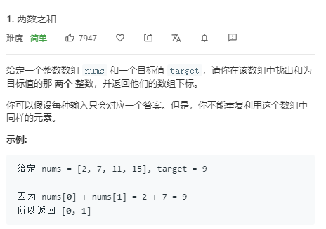
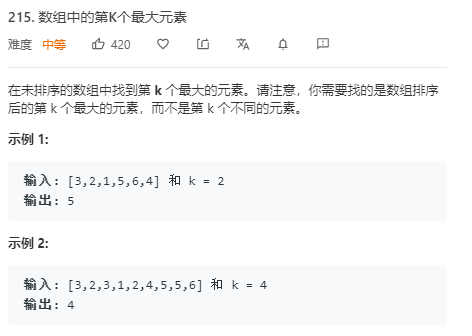
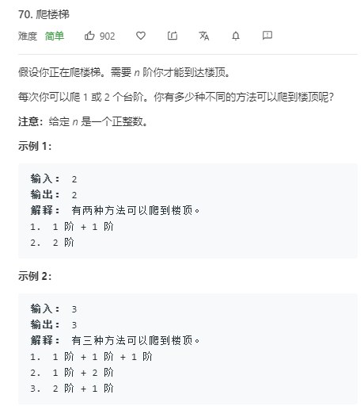
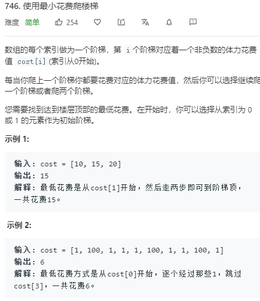
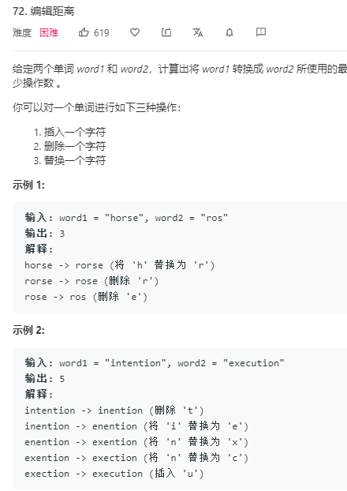
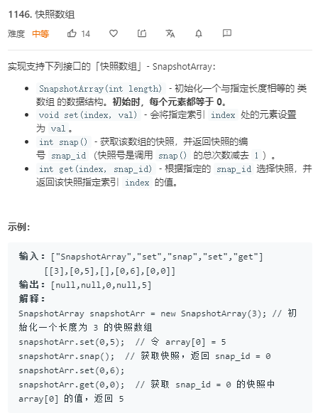
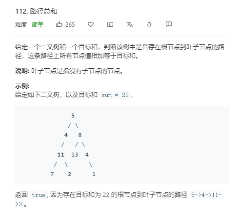
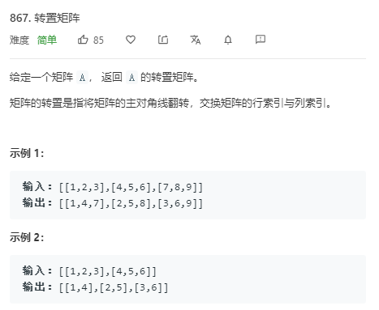
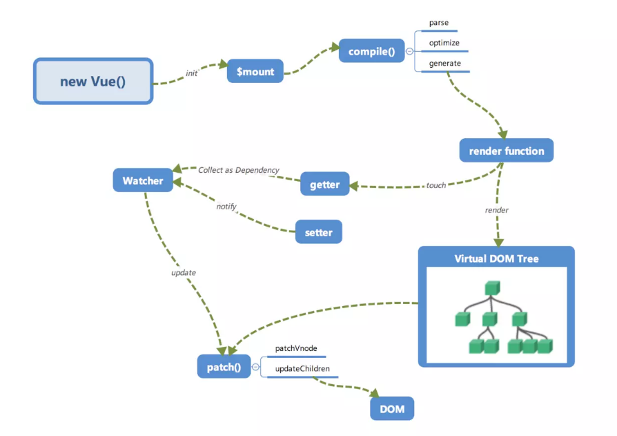

艺术喵 2 年前端面试心路历程（字节跳动、YY、虎牙、BIGO）| 掘金技术征文
===

本文将先从个人背景讲起，然后谈谈在字节跳动、虎牙、YY 以及 BIGO 的面试经过，最后讲一下关于计算机基础、算法与数据结构、JavaScript 等方面的学习经验，以及聊聊个人学习经验。

文章整理不易，欢迎小伙伴们点赞、评论吐槽~

## 现状

### 个人背景

2016 年到 2017 年在网易互动娱乐从事游戏品牌宣传后期美术、CC 语音（现 CC 电竞）的栏目包装和现场导播助手，由于一些原因放弃美术这个行业。

于是在 2017 年毕业后准备了 6 个月考研计算机，那时候真的痛苦，从零开始学数据结构、计算机网络、组成原理和操作系统，还要数学。

不负众望，没考上就出来找工作。

从以上背景来说，我的经历可以是超级减法，被人按在地上摩擦。

### 面试情况

- 字节跳动 offer
- 虎牙 offer
- YY offer 
- BIGO offer call

好像基本给我去面试就都过了，剩下内推投了简历基本连面试机会都没有……

由于家在广州，还是想在广州发展所以深圳的岗位就没去面了。

而且这几家面试感觉都有点反套路，经常黑人问号。

## 大厂面经

### 字节跳动

#### 1 面

- 对 tree-shaking 的了解  
    - 虽然生产模式下默认开启，但是由于经过 babel 编译全部模块被封装成 IIFE
    - IIFE 存在副作用无法被 tree-shaking 掉
    - 需要配置 `{ module: false }` 和 `sideEffects: false`
    - rollup 和 webpack 的 shaking 程度不同，以一个 Class 为例子
- Common.js 和 es6 module 区别
    - commonJs 是被加载的时候运行，esModule 是编译的时候运行
    - commonJs 输出的是值的浅拷贝，esModule 输出值的引用
    - webpack 中的 webpack_require 对他们处理方式不同
    - webpack 的按需加载实现
- 你写的脚手架其中有一个模板是针对销售快速迭代的情节，能介绍一下吗
    - 介绍项目背景：页面多，迭代快，管理混乱，并且 webpack 配置不一样
    - 使用只需要在 page 里面新建文件，然后放入 main 和一些配置文件，输入命令：`npm run page=[文件夹名称] env=[环境] method=[dev|build]`
    - 介绍一下 node 如何实现，和 webpack 配置合并策略
- 图片编辑器做的性能优化
    -  图片变化通过矩阵变化，移除 html2Canva
    -  抽离 Matrix.js 里面的三元一次方程求解公式来取代传统的克拉默法则
    -  自定义栈，通过可逆矩阵，亮度，饱和度，色差的逆公式，做出返回效果，而不是每次结果用 base64 保存，消除内存消耗
    -  webwork 的尝试和数据测试，证明在计算量不大情况下反而更慢
    -  window.performance.mark 埋点，和 1px 的 gif 上传关键步骤时间优化
- 能介绍一下缓存策略吗
    - 强缓存 cache-control、express
    - 协商缓存 304、ETag、modify

- 301、302、307、308的区别

OK，搞完上面问题，开始做题：

- [1. 两数之和](https://leetcode-cn.com/problems/two-sum/) ：5 分钟内就做完

- 洗牌算法：5分钟内写完

> 这里找不到一模一样的题目，感兴趣的小伙伴可以 百度/Google 找找

做完上面 2 道题后：

面试官：emm....面试时间还没结束再做一道题目吧！

- [215. 数组中的第K个最大元素](leetcode-cn.com/problems/kth-largest-element-in-an-array/)

- 花了点个大顶堆，然后很快就求出来  
- 面试官：emm。。。。还有点时间，你还有想到别的办法吗
- 又写了个快排解法，写完之后面试官说顺便写个归并排序，我就改了一下写出来

好了，面试结束，然而这才是噩梦的开始。由于算法题做的太快，不知面试官写了我啥评价，后面的面试基本变成做各种题。

#### 2 面

- 图片编辑器做的性能优化（以上）
- redux-saga 和 mobx 的比较
    - saga 还是遵循 mvc 模型，mobx 是接近 mvvm 模型
    - 介绍项目为何要使用 mobx 更合适
    - 由于是直播相关的 electron 项目，存在音视频流，和一些底层 OS 操作，那么我们是否可以以麦克风视图开关对于音频流的处理为例子，把 OS 的一些操作与数据做一个映射层，就像数据和视图存在映射关系一样，那么数据的流动就是 view -> 触发action -> 数据改变 -> 改变视图 -> 进行 os 操作
    - 然后说了一下 mobx 大概实现的原理，如数据劫持，发布订阅。
- https 有了解吗
    - 简单讲了一下非对称加密的握手过程
    - 证书签名过程和如何防止被串改
- 跨域有了解过吗
    - webpack-dev-server 原理和如何处理跨域
    - nginx 转发
    - CROS 中的简单请求和非简单请求
    - 非简单请求下发起的 options
- localstorage、sessionStorage 和 cookie 的区别
- cookie 跨域时候要如何处理

然后就开始做题：

- [70. 爬楼梯](https://leetcode-cn.com/problems/climbing-stairs/)

（又是 5 分钟写完）

- 面试官：那我们改编一下题目，改成 [746. 使用最小花费爬楼梯](https://leetcode-cn.com/problems/min-cost-climbing-stairs/)。

- 我：修改一下之前的答案，很快做出来。
- 面试官：还有点时间，我们再做一题稍微难一点的 [72. 编辑距离](https://leetcode-cn.com/problems/edit-distance/)

我：这题居然说稍微难点？？？还好之前做过，那方法真的不是一般人想得出来。然后又做出来了。

面试结束了，感觉都是在做题。

#### 3 面

- 自我介绍
- 介绍项目
- electron 的主进程，渲染进程之间区别和他们通信手段
    - ipcMain、ipcRenderer
    - localStorage
- webView 和 Iframe 区别
    - webView 应用和嵌入内容之间的交互全部都是异步的
    - 应用和嵌入内容之间的交互全部都是异步的
- 你这个 PC 应用做了哪些优化
    - 录屏优化
    - 大型文件上传优化
    - 用 mobx 重写之前的 redux-saga，引入 os 层概念
    - electron-update 失效紧急处理办法
- 大型文件上传
    - 文件切片
    - 用 web-work 单独线程计算文件的 hash 值
    - 上传由于和其他接口同一域名，所以要做并发数处理
    - 进度条
    - 对于已经传过的文件进行跳过秒传，对于失败做失败重传处理
    - 然后有说了一下感觉还能改进的地方
    - 要发挥 electron 能使用 node 的优势，文件切片，hash 计算和上传都可以用 node 实现，并且开不同的进程处理。由于上传是用 node 模块，不会有浏览器同一域名下 6 个连接的限制。为何没做，因为在写别的更加紧急的东西。。。。
- 录屏优化
    - 需要对整个屏幕进行录制
    - 对比了 FFmpeg 和 mediaSource 的性能差异，如 CPU 和内存消耗
    - 又对比一下 mediaSource 的各种编码性能差异 vp8、daala、h264、opus 和 mpeg
    - 一开始是把视频流写在一个变量里面，这样会造成很大的性能问题
    - 解决办法是每个 10s 把流用 node 的 file 写在硬盘里面，然后结束录制时候，把每个 10s 的小视频片段用 FFmpeg 合成一个大的文件

开始做题，做了一题比较偏冷的题目，看概念我都要理解几分钟的。

虽然做出来，但是不是用数组实现，而是用链表，面试官问我如何再优化，我就是说改成调表，空间换时间，但是其实正确答案是二分查找……

#### 4 面

四面就比较轻松，问了一下项目就开始做题。

先从简单开始 [112. 路径总和](https://leetcode-cn.com/problems/path-sum/description/)

做完后在此基础上，改变成

* `路径不需要从根节点开始，也不需要在叶子节点结束`

虽然题目不难，我也做了减枝的处理，但是面试官说还能优化，如何减少重复计算。这就难倒我了，我知道需要用一个 map 来保存中间的结果，但是这个 map 的 key 如何设计一时想不出来。想了很久说没思路面试就结束了。

### 虎牙

#### 1 面

- http 的 get 和 post 区别
- 缓存策略
- https 的握手过程
- http2 的特点
    - 二进制传输
    - Header 压缩，顺便吹了一下哈夫曼编码
    - 多路复用
    - 服务器推送
- weak-Set、weak-Map 和 Set、Map 区别
- mvvm 模型和 mvc 模型区别
- 如何实现一个 mvvm 模型
    - 数据劫持 + 发布订阅
- 为何你用 mobx 重构了 saga，说说两者之间的区别
    - 简单说了一下 mobx 的实现原理
- 说说 vnode 的了解
    - vnode 是作为数据和视图的一种映射关系
    - vue 和 react 的 diff 算法有相同和有不同，相同是都是用同层比较，不同是 vue使用双指针比较，react 是用 key 集合级比较
- 讲讲 webpack 的性能优化
    - 体积：讲了一下 tree-shaking 了解
    - 打包速度：cache-loader、dll、多线程
- 有写过 plugin
    - 没有，但是了解他的原理，讲了一下大概有哪些 compiler 钩子
- 了解 webpack-dev-server 的 HMR 实现原理吗 
- 手写一下防抖和节流

#### 2 面

- 你做过直播，能介绍一下 webRTC 或者现在使用直播方案吗
    - 虽然我是使用声网的 SDK，但是大概了解过一般直播的直播方案
    - 讲了一下 NAT、STUN、RTP、SDP 的基本概论
    - 然后两个信令服务器，一个是声网用来控制进房间媒体流的 socket，一个是业务逻辑的 socket
- 编码方面有了解过吗，能解释一下码率吗
- 对于 P 帧、I 帧、B 帧有了解过
    - I 帧：关键帧。可以单独解码成一幅完整的图像。
    - P 帧：参考帧。解码时依赖于前面已解码的数据
    - B 帧：前后参考帧 B 帧后面的 P 帧要优先于它进行解码，然后才能将 B 帧解码
- RGB 和 YUV 区别
- 有了解过哪些直播协议
    - httpflv 传输方式：http 流，格式：flv，连续流
    - rtmp 传输方式：tcp 流，格式：flv，连续流
    - hls 传输方式：http，格式：TS 文件，移动端兼容但 PC 不兼容
    - dash 这个不太常见只知道传送方式是 http
- flv 和 mp4 区别有了解过吗
    - 他们都是属于容器，区别在于文件头信息
    - flv 是属于流式文件是可以边传边解的，不需要通过索引分包，但是 mp4 是需要依赖索引表
- MediaSource 规范有了解过
    - 没怎么了解，但是还是扯了一下不同码率视频切换是怎么做的

然后还问了一下别的东西，但是我不是很懂就不知清楚了，感觉这一轮面试好奇怪。前端基本没面，反而音视频处理问了很多。

#### 3 面

- webSocket 和 ajax 的区别
- xss、csrf 有了解过吗，如何防范
- 有了解过 React 的 fiber
    - fiber 诞生的背景，为何 react 有时间切片而 vue 不需要 
- 能简单介绍一下 react 执行过程吗
    1. jsx 经过 babel 转变成 render 函数
    2. create update
    3. enqueueUpdate
    2. scheduleWork 更新 expiration time
    3. requestWork
    4. workLoop大循环
        - performUnitOfWork
        - beginWork
        - completeUnitOfWork
    5. Effect List
    6. commit 
- 能介绍一下 hook 吗
    - 比起 hoc，hook 的复用性高
    - useState、useEffect、useRef 用法
    - 优化 usecallback、useMemo
- 情景题，做一个直播弹幕
    - 字幕的速度，大小
    - requestAnimationFarme 和 setTimeout 区别
    - 弹幕节流问题
    - socket 和轮询优缺点，弹幕池的设计
    - 如何避免弹幕碰撞（这个我答得不好，后来搜索一下有一个飞机场算法）

#### 4 面

这一面就是聊人生，扯得比较远。讲了一下产品一般盈利套路，如何拉新、留存、激活、转换和收益。以前在网易 CC 电竞做的事情。对中国电竞前景的看法。

### Bigo

#### 1 面

由于是年前面的，所以在会议室面
- 自我介绍
- 介绍项目
- 你项目用到线形代数，我来考考你记不记得可逆矩阵的逆矩阵求法。
    - 当场白板可逆矩阵的逆矩阵求法 
- 求一下三个三元一次方程
    - 当场白板用克拉默法则求出方程 x,y,z 的解
    - 然后写一下 matrix.js 里面的优化方程（虽然我也不知道他是什么原理）
- 如何使用尽可能少的空间做矩阵的转置
    - 本质上就是[867. 转置矩阵](https://leetcode-cn.com/problems/transpose-matrix/) 
 

然后有白板写了一下

- 能讲讲欧拉角和旋转矩阵吗，还有他们的相互转换
    - 我：？？？不过之前做项目有 AR 集成，调用接口时候用到，所以勉强讲了一点，但是转换公式我就不会写了 

做到上面，我就十分懵逼，我是不是面错岗位了。

然后是情景题，当场设计系统。

情景以下：

- 这是一个多人在线协同网页
- 主要做的是视频标识系统，用来训练 AR 用的模型
- 并且同一时间，用一视频帧可以有多个人标识

emm。。。。那我大概知道为何之前问我这么多数学问题

这个项目的难点有以下

- 视频的时间帧的确定
    - 由于视频中会存在 I 帧、P 帧、B 帧作为干扰，所以一个视频 25 帧的话，但是实际上不是每一秒都是 25 帧的，每秒帧的数目是动态的
    - 但是视频信息又对应地方 DTS 即解码时间戳，这个时间戳的意义在于告诉播放器该在什么时候解码这一帧的数据，和 PTS 即显示时间戳，这个时间戳用来告诉播放器该在什么时候显示这一帧的数据。我们只需要拿到 PTS 就可以了
- 绘画过程中 canvas 的优化
    - canvas 应该分两层，一层是没有选择的图形，一层是选中的图形，当图形选中时候会提升到编辑区域的 canvas
    - 对于不规则图形，选择判断方法使用射线法思路，带入公式就可以知道图形是否被选择
- 多人协同问题，他们之间如何互相通知
    - 使用信令服务器，用 websocket 连接
- 如果两个人以上同时对一个标签做处理，这种冲突如何处理
    - 其实这个在我做在线白板时候会遇到的问题，这种问题可以类比成游戏中的状态同步和帧同步这两种解决办法，就和面试官扯了一下。

面完情景题，就做算法题，题目也是很奇怪的。

- 第一题：洗牌算法，这个可以

- 第二题：假设有偶数位的整数，将整数分开两边，然后对每边的每个数组的每一位求总和，当两边的总和相对就认为这组数符合要求，求2n位数的符合要求数占总数的多少。。。。。有点晕

- 例子：287962 可以分成 287 962，其中 2 + 8 + 7 = 9 + 6 + 2，那么他就是符合要求的。

> 我想了很久还是想不出来。 

#### 2 面

可能一面比较难，二面就比较随便：

- 浏览器缓存策略
- 跨域处理
- https 握手
- http2 特性
- tcp 三次握手
- 从 url 到页面显示
- redux 和 mobx 的差异
- tree-shaking
- 项目的性能优化
- css 的 BEM 规范
- 当场设计一个 toast
- LRU 实现
- DNS 的路径选择用了啥算法

#### 3 面

聊得比较广，没啥重点

### YY

#### 1 面

- mvvm 和 mvc 模型区别
- mvvm 的实现
- 了解 fiber 吗
    - 答案之前有 
- 了解 hook 吗
    - 答案之前有
- 为何 react 点击事件放在 settimeout 会拿不到 event 对象
    - react 的事件合成
- setState 是异步还是同步
    - 本质上都是同步，只不过改变 state 的时机不同
    - 由一个是是否批量更新变量来决定
    - 放在 setTimeout 就能实时改变
- 有用过 node 吗，讲讲流
- koa2 和 express 区别
    - express 是大而全有路由等，koa2 小而精通过中间件
    - koa2 能使用 async await，express 不能
    - koa2 有洋葱模型和 ctx 上下文，express 没有
- 讲讲洋葱模型
- 实现一个函数 compose([fn1,fn2,fn3..]) 转成 fn3(fn2(fn1()))
    - 这个本质上就是中间件实现逻辑，之前看了 Koa2 一点源码，还好记得
- koa2 和 egg 的区别
    - egg 是在 koa2 上的封装 
    - egg 有 controller，service，router
    - 约定了文件目录结构
- 鉴权有了解过了
    - Seesion/cookie
    - Token
    - OAuth
    - SSO
    - 还好项目都涉及过，虽然不是我用node写的，是后端写的，但是那时候好奇问了一下，并且查了一些资料，勉强答出来

#### 2 面

- 浏览器缓存策略
- 跨域处理
- https 握手
- xss 和 csrf 攻击
- Typscript 有了解吗，能讲讲吗
    -  接口
    -  枚举
    -  泛型
- webpack 优化
- tree-shaking
- HMR 实现原理
- nginx 有了解吗
    - 扯了一下跨域如何配置/转发
    - 缓存策略配置
    - 地址重定向配置
- 场景题，做一个页面下雪
    - 写一个粒子 Class，里面有粒子、大小、图片，每秒移动的距离
    - 一个粒子控制器 Class，包含粒子数量、分布情况，粒子的下落速度
    - 用 requestanimationframe 绘画动画
    - 用 css3 开启硬件 GPU 加速

#### 3 面

三面也是聊得很广，基本木有前端。

## 学习过程

其实也没有太过特意去准备面试，其实都是靠平时积累的，在 2019 年开始我就制定了自己的学习计划了，并且每天都坚持学习。可参考 [lien的每日学习](https://github.com/LienJack/daliy-study)

以下会分为：

1. [计算机基础](###计算机基础)
2. [前端专业知识](###前端专业知识)
3. [学习心得](###学习心得)

顺序有优先度之分，之所以把计算机基础放在第一位，是因为经过这些面试发现计算机基础考察还有比前端还要多，甚至有些公司面试都不怎么问我前端了。

### 计算机基础

tip：里面涉及很多都是极客时间的课程，然而我并没有打广告。推荐是因为我看完后真心觉得讲的好，当然好是指容易让初学者了解和上手，深度还是去看专门的权威书做普通吧。

#### 数据结构和算法

学习办法不是一开始就刷题，要先学点入门。

1. 入门方式有很多种看书看视频，边看边敲。
2. 然后就可以上网看别人面经和一些 leetcode 大神总结的经典题目，按照分类开始刷了。
3. 每道题至少做 3 次，第一次时候遇到不会就不要想很久，8 分钟没有思路就看答案。因为大家一开始都是没啥思路，只有做多多总结才会慢慢有思路。做完后一周后再做第二次。准备跳槽时候再做第三次。
4. 算题顺序为算法面试通关 40 讲、剑指 offer、字节跳动专栏、自己总结的高频题。

我刷的题目也不多，就 100 来道，和别人比起就差远了。

但是我做的题目范围比较广，而且都是自己总结高频再去做，命中的几率比较大。

基本数据结构

- 数组
- 队列和栈
- 链表
- 二叉树
- hash
- 堆

常见的算法

- DFS
- BFS
- 滑动窗口（双指针）
- 回溯
- 动态规划
- 贪心（其实动态规划可以解决）
- 排序
- 二分查找

参考资料：

- [JavaScript版 数据结构与算法](https://coding.imooc.com/class/315.html)，这个适合新人学习，入门基本。
- [极客时间- 数据结构与算法之美](https://time.geekbang.org/column/intro/126) 在有基础上看这个会更好，里面github有js实现方式，自己动手敲一遍
- [极客时间- 算法面试通关 40 讲](https://time.geekbang.org/course/intro/130) 这门课真的是好，里面都是高频经典的题目。
- [leetcode 字节跳动专栏](https://leetcode-cn.com/explore/interview/card/bytedance/)
- [leetcode 剑指 offer](https://leetcode-cn.com/problemset/lcof/)

blog:

- [awesome-coding-js](conardli.top/docs/) 用 JavaScript 实现的算法和数据结构
- [labuladong](https://labuladong.gitbook.io/algo/) 这个动态规范讲得真的好
- [YaxeZhang/Just-Code](https://github.com/YaxeZhang/Just-Code) 针对面试训练算法题， 目前包括字节跳动面试题、 LeetCode 和剑指 offer 

#### 网络

网络是前端重要中的重要，也是面试高频的范围。很多人都是一开始就去看计算机网络、TCP/IP 协议、这些书入门，也不是说不好，但是对于新手入门门槛可能太高，还没看几页就放弃了。可以一开始看点视频跟着作者一起来抓包，慢慢熟悉。

观看顺序：

- [极客时间-透视 HTTP 协议](https://time.geekbang.org/column/intro/189) HTTP作为前端最经常接触而且相对独立，可以先学习这个，再学期其他层。
- [极客时间-趣谈网络协议](https://time.geekbang.org/column/intro/85)作者生动用例子解释网络各层的作用和他们之间的关系，在此形成一个整体的架空，方便后面细节的学习
- [极客时间 - Web 协议详解与抓包实战](https://time.geekbang.org/course/intro/175)。这门课从高层到底层，讲解每一层的细节，由于里面讲解很详细也有很多理论知识，如 RSA 算法、基于椭圆曲线的 ECDH 算法等等可以考虑跳过  

最后补充的书籍

- 图解 http 协议
- 图解 tcp 协议
- TCP/IP 详解（第一卷）

tips：

对于前端来说，http，http2，https 的握手是高频题，要主要复习。

#### 其他

本来想聊聊计算机组成原理、操作系统和编译原理，但是一个我学得不精，第二面试也没有怎么问，操作系统就问 linux 的一些简单指令和写一下 Jenkins 的脚本而已。或者后端对这方面会问得比较多。

### 前端专业知识

#### 前端基础-JS

以下必须要十分熟悉：

- 类型，涉及以下：
    - 类型种类
    - 判断
    - 转换
    - 深度拷贝
- 闭包，涉及以下：
    - 作用域
    - v8 垃圾回收
    - 变量提升
- 异步，涉及以下：
    - Promsie 的历史，用法，简单手写 Promsie 实现
    - async await 原理，generator
    - 宏任务与微任务区别
- 原型链，涉及以下
    -  `prototype` 和 `__proto__`
    -  继承
    -  oop 编程思想
- 模块化
    - CommonJS 和 ES6 module
    - AMD 与 CMD 区别（比较旧可以忽略）
- ES6 特性
    - let const 
    - 箭头函数
    - Set、Map、WeakSet 和 WeakMap
    - 之前提及的 Promsie，async，Class，Es6 module

参考资料：

先做一份自我检测，[一名【合格】前端工程师的自检清单](https://juejin.im/post/5cc1da82f265da036023b628#heading-20)。然后根据自己薄弱点去看相关资料。

书籍：

入门

- 《JavaScript高级程序(第三版)》
- 《你不知道的JavaScript(上)》
- 《JavaScript 忍者秘籍》（一定要买第二版）
- 《阮一峰 ES6入门》 

BLOG:

- [前端进阶之道](https://yuchengkai.cn/docs/frontend/) 
- [前端面试与进阶指南](https://www.cxymsg.com/)
- [ConardLi 的 blog](http://www.conardli.top/blog/)
- [木易杨前端进阶](https://www.muyiy.cn/)
- [FE-Interview](http://blog.poetries.top/FE-Interview-Questions/)
- [冴羽的博客](https://github.com/mqyqingfeng/Blog)  

掘金好文章：

- [(1.6w字)浏览器与前端性能灵魂之问，请问你能接得住几个？（上）](https://juejin.im/post/5df5bcea6fb9a016091def69)
- [(建议收藏)原生JS灵魂之问, 请问你能接得住几个？(上)](https://juejin.im/post/5dac5d82e51d45249850cd20)
- [(建议精读)原生JS灵魂之问(中)，检验自己是否真的熟悉JavaScript？](https://juejin.im/post/5dbebbfa51882524c507fddb)
- [(2.4w字,建议收藏)😇原生JS灵魂之问(下), 冲刺🚀进阶最后一公里(附个人成长经验分享)](https://juejin.im/post/5dd8b3a851882572f56b578f)
- [中高级前端大厂面试秘籍，为你保驾护航金三银四，直通大厂(上)](https://juejin.im/post/5c64d15d6fb9a049d37f9c20)
- [(中篇)中高级前端大厂面试秘籍，寒冬中为您保驾护航，直通大厂](https://juejin.im/post/5c92f499f265da612647b754)
- [(下篇)中高级前端大厂面试秘籍，寒冬中为您保驾护航，直通大厂](https://juejin.im/post/5cc26dfef265da037b611738)

付费好东西：

对知识付费其实是好事情，站在巨人的肩膀上看东西才会远。
- [前端面试之道](https://juejin.im/book/5bdc715fe51d454e755f75ef) |比较基础的前端知识，适合新人
- [前端开发核心知识进阶](https://gitbook.cn/gitchat/column/5c91c813968b1d64b1e08fde)| 从基础出发，由浅入深，还有关于很多工程方面的文章，十分推荐。

#### 前端基础-浏览器

有以下比较经典的问题：

- 缓存策略：协商缓存和强缓存
- 页面的渲染过程
- 页面性能优化

参考资料：

- [浏览器工作原理与实践](https://time.geekbang.org/column/intro/216)。这个也是个人十分推荐，因为本人看过《webkit技术揭秘》，发现书上很多东西都是讲浏览器一些实现方式，一堆 C++ 十分难受，但是这个专栏却用十分简单生动的方式来讲述浏览器本质，个人收获很多。
- 《webkit技术揭秘》

#### 前端基础-css

- css 选择器优先度
- rem、em、vh、vw 和 px 的关系，以及移动端适配方式
- 清除浮动
- 盒子模型
- flex
- 层级上下文
- 各种布局

#### 前端框架-vue

1. 第一个层次：使用
    - vue 的生命周期
    - vue 全家桶使用，vuex，vue-router
    - data，computer，watcher使用
    - 组件通信
        - provide / inject
        - pros emit
        - $attr $listen
        - event bus
        - 自行实现 dispatch 和 broadcast 方法
2. 第二层：原理
    - 如何简单实现一个mvvm模型
    - new vue 时候发生什么，每个生命周期对应的源码做了什么
    - data，watcher，computer的源码实现
    - nextTick 的原理
    - 指令的本质
    - vue 的性能优化
    - Diff 本质
3. 第三层：组件的实现

参考资料：

1. 基础使用： 
    - [jspang的vue教程](jspang.com/detailed?id=21) 
    - [Vue2.0开发企业级移动端音乐Web App](https://coding.imooc.com/class/107.html)
    - [前端成长必经之路 组件化思维与技巧](https://coding.imooc.com/class/175.html)
2. 源码：
    - 要先看[剖析 Vue.js 内部运行机制](juejin.im/book/5a36661851882538e2259c0f)
    把手教你如何写一个最小mvvm模式，mvvm是最核心的思想。当你能懂下面的图时候,那么可以进入下一步了

    

    - 《深入浅出Vue.js》， 这本书真的好，作者每单介绍一个部分的时候，都会由最简单抽象的一个demo，一步一步变成框架实际的样子，最后拿你写的demo和框架实际的对比，分析双方优缺点。

    

    - [Vue.js源码全方位深入解析](https://coding.imooc.com/class/chapter/228.html#Anchor)做补充。电子书：[ 《Vue.js 源码揭秘》](https://ustbhuangyi.github.io/vue-analysis/)对于router，vuex，slot，keep-alive有详细解释。
    - [尤雨溪教你写vue 高级vue教程 源码分析](https://www.bilibili.com/video/BV1d4411v7UX/)!!!!这个我特意去fronted master冲了几百元，没想到居然有搬运。
    - 最后看完就做一下题目，看看自己能达到那种水平吧。[12道vue高频原理面试题,你能答出几道?](https://juejin.im/post/5e04411f6fb9a0166049a073)
3. 组件
    - 先看一下别人的写组件的经验 [Vue.js 组件精讲](https://juejin.im/book/5bc844166fb9a05cd676ebca)。看完之后就开始动手自己模仿别人的组件了。
    -  推荐模仿对象：
        -  [vant](https://youzan.github.io/vant/#/zh-CN/)
        -  [View](https://github.com/view-design/ViewUI)

#### 前端框架-react

使用：
    - Class 的生命周期
    - Hooc 高阶组件
    - Hook 的使用
    - react-router 的使用
    - Context
    - redux（包括mobx或saga)

参考资料：

- [jspang的react教程](jspang.com/detailed?id=30)
- [Hooks 重构旅游电商网站火车票](https://coding.imooc.com/class/348.html)
- [React.js 小书](http://huziketang.mangojuice.top/books/react/)先来简单实现一个mvc模型的react吧。

然后 react 最难就是 fiber，fiber 的代码实现十分复杂，这时候无需太过关注代码，只需要知道，fiber 是解决什么问题而诞生，以及相关的概念就好。

推荐按以下顺序阅读文章

1. [这可能是最通俗的 React Fiber(时间分片) 打开方式](https://juejin.im/post/5dadc6045188255a270a0f85) 这文章如标题，真是最通俗易懂。
2. [Deep In React之浅谈 React Fiber 架构](https://mp.weixin.qq.com/s/dONYc-Y96baiXBXpwh1w3A)
3. [Fiber 内部: 深入理解 React 的新 reconciliation 算法](https://zhuanlan.zhihu.com/p/59055212)
4. [如何以及为什么 React Fiber 使用链表遍历组件树](https://juejin.im/post/5c31ffad6fb9a04a0a5f56f4)

有能力者，可以直接科学上网看原文吧

1. [Lin Clark - A Cartoon Intro to Fiber - React Conf 2017](https://www.youtube.com/watch?v=ZCuYPiUIONs)
2. [Inside Fiber: in-depth overview of the new reconciliation algorithm in React](https://medium.com/react-in-depth/inside-fiber-in-depth-overview-of-the-new-reconciliation-algorithm-in-react-e1c04700ef6e)
3. [In-depth explanation of state and props update in React](https://medium.com/react-in-depth/in-depth-explanation-of-state-and-props-update-in-react-51ab94563311)
4. [The how and why on React’s usage of linked list in Fiber to walk the component’s tree](https://medium.com/react-in-depth/the-how-and-why-on-reacts-usage-of-linked-list-in-fiber-67f1014d0eb7)
5. [Practical application of reverse-engineering guidelines and principles](https://medium.com/react-in-depth/practical-application-of-reverse-engineering-guidelines-and-principles-784c004bb657?source=collection_home---4------3-----------------------)
  
以下按自己喜欢挑选吧：

- react 的事件机制

1. [【React深入】React事件机制](https://segmentfault.com/a/1190000018391074)
2. [谈谈React事件机制和未来(react-events)](http://www.feingto.com/?p=11049)

- react 调度机制

1. [【React深入】setState的执行机制](https://segmentfault.com/a/1190000018260218)
2. [再谈react setState-setState如何处理更新？](https://zhuanlan.zhihu.com/p/52052584)

- Hook

1. [react hooks的诞生](https://zhuanlan.zhihu.com/p/50953073)
2. [react hooks进阶与原理](https://zhuanlan.zhihu.com/p/51356920)

- yck 系列

1. [剖析 React 源码：先热个身](https://juejin.im/post/5cbae9a8e51d456e2809fba3)
2. [剖析 React 源码：render 流程（一）](https://juejin.im/post/5cca5ad2e51d456e6154b4c7)
3. [剖析 React 源码：render 流程（二）](https://juejin.im/post/5ce21cfb6fb9a07eec599b9f)
4. [剖析 React 源码：调度原理](https://juejin.im/post/5cef5392e51d4510727c801e)
5. [剖析 React 源码：组件更新流程（一）](https://juejin.im/post/5d25ec85f265da1bd605cd9d)

热身做完，直接上战场吧：

视频：[React源码深度解析 高级前端工程师必备技能](https://coding.imooc.com/class/309.html)

电子书： [React 源码解析](https://react.jokcy.me/)

惭愧，我到现在还没看完。

看得差不多就做点题目吧：
- [中高级前端大厂面试秘籍，寒冬中为您保驾护航，直通大厂](https://juejin.im/post/5c92f499f265da612647b754)
- [你要的 React 面试知识点，都在这了](https://segmentfault.com/a/1190000019339210)

组件设计：

准备看 [ant.design](https://github.com/ant-design/ant-design/) 的源码

#### 前端工程化-webpack

1. 使用和基本概念
    - 了解 loader、plugin，并且掌握一些基本常用的
    - 了解 babel

参考资料：[玩转webpack](https://time.geekbang.org/course/intro/100028901)  

2. 学会优化
    - 体积优化：tree shaking、按需引入，代码切割
    - 打包速度优化：缓存、多线程打包、优化打包路径

参考资料：

- [那些花儿，从零构建Vue工程](那些花儿，从零构建Vue工程)
- [Webpack 4 配置最佳实践](https://juejin.im/post/5b304f1f51882574c72f19b0)
- [webpack4 的30个步骤打造优化到极致的 react 开发环境](juejin.im/post/5cfe4b13f265da1bb13f26a8)

3. 原理

- [webpack构建步骤](https://www.cxymsg.com/guide/webpack.html#webpack的构建流程是什么)
- [细说 webpack 之流程篇](https://fed.taobao.org/blog/2016/09/10/webpack-flow/)
- [Webpack HMR 原理解析](https://zhuanlan.zhihu.com/p/30669007)
- [从零实现webpack热更新HMR](https://juejin.im/post/5df36ffd518825124d6c1765)
- [干货！撸一个webpack插件(内含tapable详解+webpack流程)](https://juejin.im/post/5beb8875e51d455e5c4dd83f)
- [手把手教你撸一个 Webpack Loader](juejin.im/post/5a698a316fb9a01c9f5b9ca0)

4. 项目参考

其实 webpack 配置都是靠抄。。。。

- [le-cli](https://github.com/yanlele/le-cli)
- [fe-workflow](https://github.com/luoxue-victor/fe-workflow)这是我参考最多的项目，涉及了初始化项目、打包、测试、联调、质量把控、上线、回滚、线上监控（性能监控、异常监控）等等

### 学习心得

其实学习心得并没改变，只不过坚持做两年而已

#### 刻意练习

这个之前 2018 年时候写过，就不重复了~

链接：[刻意练习](https://juejin.im/post/5c36fe50518825253b5e94f4#heading-25)

#### 时间管理

对时间敏感

我桌面上有3个表

1. 倒计时 40 分钟。每次到达 40 分钟后，我必须要去休息，可以结合以前说的番茄工作法。
2. 秒表。用来检测做题的速度，这就是为何我之前面试算法题基本都是能 5 分钟写出来的原因。还有是统计业务功能需要写多久，方便之后评审排期的时间。

3. 手机 Ihour 记时。用来记录学习了多少个小时，从量变到质变的过程。

4. 计划与执行

按以前一样我会有年度计划、月度计划、周计划和日需要执行的任务，并且打卡记录当天所学

5. 注重饮食

为了确保大脑的清醒和减肥，我采取的是轻食。尽量不吃高 GI 食物，如过度加工过的食物，米饭等等，尽量吃低 GI 食物。GI 其实是血糖指数（glycemic index, GI）的英文缩写，也译作血糖生成指数。主要原理是当人血糖过高或者过低时候，会容易犯困，大脑运转速度变慢。所以要保持血糖的一定稳定，就能减少疲惫感，使效率更高。顺便可以达到减肥效果。

6. 多锻炼。每周起码有2次的跑步||游泳||撸铁

 看过我文章的人觉得学习心得怎么和以前的征文这么像，甚至连图都不换一张是不是来水文章。

 **其实我做的事情没有变，一直坚持做改变的，只有结果而已。**
